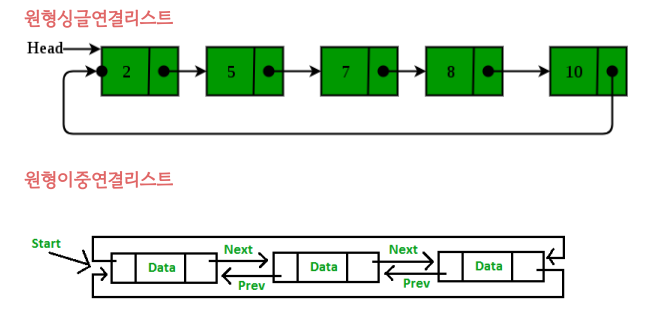

## 📓 키워드

- 주소
- 포인터
- asterisk
- 배열 포인터
- 연결리스트(LinkedList)
- 랜덤접근, 순차적접근

---

## ✏️ 메모리와 주소

- 컴퓨터의 메모리는 메모리 셀의 연속과 같으며 각 셀의 크기는 1바이트이고 고유한 주소가 존재함


- 변수의 메모리 주소란 변수가 사용하는 메모리 주소의 첫번째를 가리킴
- 메모리 주소는 16진수로 표기가 됨

## ✏️ 포인터

- 메모리 관리는 언어마다 조금은 다르게 관리됨
- 자바, 파이썬, 자바스크립트는 직접 변수에 메모리를 할당하거나 해제할 수 없고 `가비지컬렉터`를 통해 이를 수행
- C, C++은 가비지컬렉터가 없으며 직접 메모리를 예약하고 해제할 수 있으며 포인터 또한 지원함


### 💭 포인터의 개념

- 변수의 메모리를 담는 타입
- 포인터는 메모리 동적할당, 데이터를 복사하지 않고 함수 매개변수로 사용, 클래스 및 구조체를 연결할 때 사용
- `타입* 변수명`
```cpp
class Node{
public:
    int data;
    Node* next;
}

int* a = &i;
```

- 포인터의 크기는 OS가 32bit면 4바이트, 64bit면 8바이트로 고정되어 있음
- 어떠한 타입(int, double)이든 상관없이 고정됨

### 💭 역참조연산자

- `*(asterisk)`는 다양한 용도로 사용됨
- 곱셈, 포인터 타입의 선언, 역참조로 메모리를 기반으로 변수의 값에 접근할 때도 사용

```
#include<bits/stdc++.h>
using namespace std;
int main(){
    string a = "abcda";
    string* b = &a;
    cout << b << "\n";
    cout << *b << "\n";
    return 0;
}

/*
0x6ffdf0
abcda
*/
```


### 💭 array to pointer decay

- 배열이 포인터로 부식(decay)되는 현상
- 배열의 이름을 `T*` 이라는 포인터에 할당하면서 T[N]이란 배열의 크기정보 N이 없어지고, 첫번째 요소의 주소가 바인딩되는 현상
- vector(동적배열)는 불가능하고 array(정적배열)만 가능

```
#include<bits/stdc++.h>
using namespace std;
int a[3] = {1, 2, 3};
int main(){
    int* c = a;
    cout << c << "\n";
    cout << &a[0] << "\n";
    cout << c + 1 << "\n";
    cout << &a[1] << "\n";
    return 0;
}

/*
0x472010
0x472010
0x472014
0x472014
*/
```

---

## ✏️ 연결리스트(LinkedList)

- 연결리스트는 노드로 감싸진 요소를 인접한 메모리 위치가 아닌 독립적으로 저장하며 각 노드는 `next,prev라는 포인터`로 서로 연결된 선형적인 자료구조
- 싱글연결리스트, 이중연결리스트, 원형연결리스트가 존재


```cpp
class Node {
public:
    int data;
    Node* next;
    Node(){
        data = 0;
        next = NULL;
    }
    Node(int data){
      this->data = data;
      this->next = NULL;
    }
};

```

### 💭 연결리스트의 시간복잡도

- 참조 : O(N)
- 탐색 : O(N)
- 삽입 / 삭제 : O(1)

#### ☑️ 싱글연결리스트(Singly LinkedList)

- next 포인터 밖에 존재하지 않으며 한 방향으로만 데이터가 연결됨


#### ☑️ 이중연결리스트(Doubly LinkedList)

- prev, next 두개의 포인터로 양방향으로 데이터가 연결됨


#### ☑️ 원형연결리스트(Circular LinkedList)

- 마지막노드와 첫번째노드가 연결되어 원을 형성
- 종류 : 원형싱글연결리스트, 원형이중연결리스트



```cpp
#include <bits/stdc++.h>
using namespace std;
list<int> a;
void print(list <int> a){
    for(auto it : a) cout << it << " ";
    cout << '\n';
}

int main(){
    for(int i = 1; i <= 3; i++)a.push_back(i);
    for(int i = 1; i <= 3; i++)a.push_front(i);
    auto it = a.begin(); it++;
    a.insert(it, 1000);
    print(a);
    it = a.begin(); it++;
    a.erase(it);
    print(a);
    a.pop_front();
    a.pop_back();
    print(a);
    cout << a.front() << " : " << a.back() << '\n';
    a.clear();
    return 0;
}

/*
3 1000 2 1 1 2 3
3 2 1 1 2 3
2 1 1 2
2 : 2
*/
```

### 💭 랜덤접근과 순차적 접근

- 랜덤접근(Random Access)
  - 동일한 시간에 배열과 같은 순차적인 데이터가 있을 때 임의의 인덱스에 해당하는 데이터에 접근하는 기능
  - vector, array 같은 배열은 랜덤접근 가능
  - 접근할때 O(1)이 소요
- 순차적 접근(Sequential Access)
  - 데이터를 저장된 순서대로 검색
  - 연결리스트, 스택, 큐는 순차적 접근만 가능
  - 접근할때 O(N)이 소요

