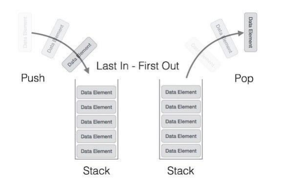
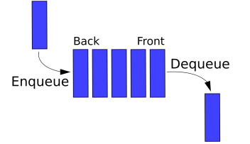

## 📓 키워드

- 스택
- 큐

---

## ✏️ 스택

- 가장 마지막으로 들어간 데이터가 가장 첫번째로 나오는 성질인 후입선출(LIFO)
- 재귀함수, 웹 브라우저 방문기록 등에 쓰임

### 💭 스택의 시간복잡도

- N번째 참조 : O(N)
- 가장 앞부분 참조 : O(1)
- 탐색 : O(N)
- 삽입 / 삭제 : O(1)



```cpp
#include<bits/stdc++.h>
using namespace std;
stack<string> stk;
int main() {
    ios_base::sync_with_stdio(false);
    cin.tie(NULL);
    stk.push("서");
    stk.push("울");
    stk.push("특");
    stk.push("별");
    stk.push("시");
    while(stk.size()){
        cout << stk.top() << "\n";
        stk.pop();
    }
}

/*
시
별
특
울
서
*/
```

---

## ✏️ 큐

- 먼저 집어넣은 데이터가 먼저 나오는 선입선출(FIFO)
- 스택과는 반대되는 개념
- CPU작업을 기다리는 프로세스, 네트워크 접속을 기다리는 행렬, 너비우선 탐색, 캐시 등에 사용

### 💭 큐의 시간복잡도

- N번째 참조 : O(N)
- 가장 앞부분 참조 : O(1)
- 탐색 : O(N)
- 삽입 / 삭제 : O(1)



```cpp
#include <bits/stdc++.h>
using namespace std;
queue<int> q;
int main(){
    for(int i = 1; i <= 10; i++)q.push(i);
    while(q.size()){
        cout << q.front() << ' ';
        q.pop();
    }
    return 0;
}

/*
1 2 3 4 5 6 7 8 9 10
*/
```