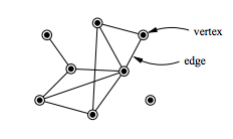
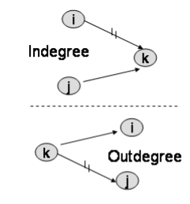
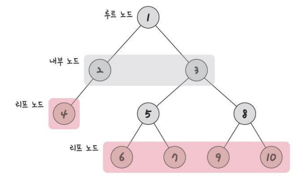
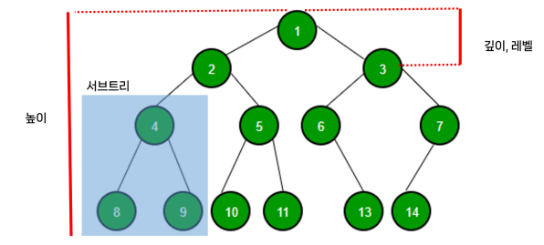
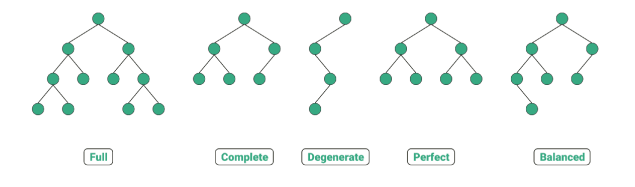
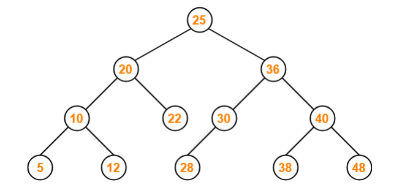
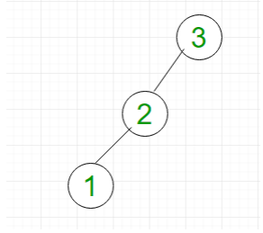

## 📓 키워드

- 그래프
- 트리
- 이진트리
- BST

---

## ✏️ 그래프

- 정점과 간선들로 이루어진 집합

### 💭 정점과 간선

- 정점(vertex) : 노드라고도 불리며 그래프를 형성하는 기본단위
- 간선(edge) : 정점을 잇는 선, 관계, 경로
  - 단방향간선, 양방향간선

#### ☑️ indegree, outdegree

- indegree : 들어오는 간선
- outdegree : 나가는 간선

#### ☑️ 가중치

- 정점과 정점사이에 드는 비용

---

## ✏️ 트리

- 자식노드와 부모노드로 이루어진 계층적인 구조
- 무방향 그래프의 일종이자 사이클이 없는 자료구조

### 💭 트리의 특징

- 부모, 자식 계층 구조를 가짐
- `V-1 = E`
- 임의의 두 노드 사이의 경로는 반드시 있으며 유일함

#### ☑️ 루트노드

- 가장 위에 있는 노드

#### ☑️ 내부노드

- 루트노드와 리프노드 사이에 있는 노드

#### ☑️ 리프노드

- 자식노드가 없는 노드

#### ☑️ 깊이

- 트리에서의 깊이는 노드마다 다르다
- 루트노드에서 특정노드까지 최단거리로 갔을 때의 거리
  - 4번노드의 깊이는 2

#### ☑️ 높이

- 루트노드로부터 리프노드까지의 거리 중 가장 긴 거리를 의미
  - 위 그림에서 높이는 3

#### ☑️ 레벨

- 깊이와 같은 의미를 가짐
- 부모노드를 레벨0 또는 레벨1이라 칭하고 자식노드들은 +1 레벨씩 올라간다

#### ☑️ 서브트리

- 트리내의 부분집합

#### ☑️ 숲

- 트리가 2개 이상 모여 이루어진 집합

---

## ✏️ 이진트리

- 각 노드의 자식노드 수가 2개 이하로 구성되어있는 트리

- `Full binary tree(정이진트리)` : 자식노드가 0 또는 2개인 이진트리
- `Complete binary tree(완전이진트리)` : 왼쪽에서부터 채워져 있는 이진트리, 마지막 레벨을 제외하고는 모든 레벨이 완전 채워져 있으며 마지막 레벨의 경우 왼쪽부터 채워져있음
- `Degenerate binary tree(변질이진트리)` : 자식노드가 1개밖에 없는 이진트리
- `Perfect binary tree(포화이진트리)` : 모든 노드가 꽉차 있는 트리
- `Balanced binary tree(균형이진트리)` : 모든노드의 왼쪽 서브트리와 오른쪽 서브트리의 깊이 차이가 1이하인 트리

### 💭 이진탐색트리(BST)

- 부모노드의 오른쪽 서브트리에는 `부모노드의 값보다 큰 값`
- 부모노드의 왼쪽 서브트리에는 `부모노드의 값보다 작은 값`
- 전체 탐색을 하지 않아도 되서 검색에 용이하다

#### ☑️ BST의 시간복잡도

- 균형잡히게 분포가 되어있다면 탐색, 삽입, 삭제, 수정 모두 `O(logN)`

- 그러나, 선형적(직선)의로 삽입이 되었다면 `O(N)`이 되어버림
- 즉, 이진탐색트리는 삽입순서에 따라 영향을 받는다
- 이를 해결하기 위해, 트리의 노드들을 회전시키는 등의 방법을 통해서 AVL트리, 레드블랙트리를 사용하여 `O(logN)`의 시간복잡도를 보장받음