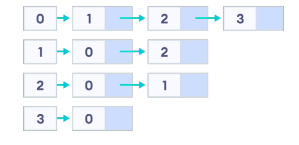
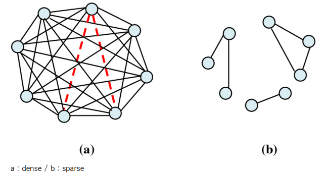

## 📓 키워드

- 인접행렬

---

## ✏️ 인접행렬(adjacency matrix)

- 컴퓨터에게 내가 이러한 그래프를 그렸다고 알려줄 표현 방법
- 인접해있다 = 연결되있다
- 그래프에서 정점과 간선의 관계를 나타내는 bool 타입의 정사각형 행렬을 의미
- 0은 두 정점사이에 경로가 없음을 의미하며, 1은 두 정점사이에 경로가 있음을 의미
- BFS, DFS에 활용됨


```cpp
bool a[4][4] = {
    {0,1,1,1},
    {1,0,1,0},
    {1,1,0,0},
    {1,0,0,0}
}

int V = 4;
for(int i = 0;i < V; i++){
    for(int j = 0; j < V; j++){
        if(a[i][j]){
            // 출력하는 로직
            cout << i << "부터 " << j << "까지 경로가 있습니다.\n";
            // 해당 정점으로 부터 탐색하는 로직
            bfs(i);
            dfs(i);
        }
    }
}
```

#### ☑️ 예제

- 정점은 0번 부터 9번까지 10개의 노드가 있다. 1 - 2 / 1 - 3 / 3 - 4 라는 경로가 있다.
- 0번부터 방문안한 노드를 찾고 해당 노드부터 방문, 연결된 노드를 이어서 방문해서
  출력하는 재귀함수를 만들고 싶다면 어떻게 해야할까? 또한, 정점을 방문하고 다시
  방문하지 않게 만드려면 어떻게 해야할까?

```cpp
#include<bits/stdc++.h>
using namespace std;
const int V = 10;
bool a[V][V], visited[V];

void go(int from){
    visited[from] = 1;
    cout << from << '\n';
    for(int i = 0; i < V; i++){
        if(visited[i]) continue;
        if(a[from][i]){
            go(i);
        }
    }
    return;
}

int main(){
    a[1][2] = 1; a[1][3] = 1; a[3][4] = 1;
    a[2][1] = 1; a[3][1] = 1; a[4][3] = 1;
    for(int i = 0;i < V; i++){
        for(int j = 0; j < V; j++){
            if(a[i][j] && visited[i] == 0){
                go(i);
            }
        }
    }
}

/*
1
2
3
4
*/
```

---

## ✏️ 인접리스트(adjacency list)

- 그래프에서 정점과 간선의 관계를 나타내는 연결리스트를 의미



```cpp
#include<bits/stdc++.h>
using namespace std;
const int V = 4;
list<int> adj[V];
int main(){
  adj[0].push_back(1);
  adj[0].push_back(2);
  adj[0].push_back(3);
  
  adj[1].push_back(0);
  adj[1].push_back(2);
  
  adj[2].push_back(0);
  adj[2].push_back(1);
  
  adj[3].push_back(0);
  
  for(int i = 0; i < 4; i++){
    cout << i << " :: ";
      for(int there : adj[i]){
        cout << there << " ";
      }
    cout << '\n';
  }
}

/*
0 :: 1 2 3
1 :: 0 2
2 :: 0 1s
3 :: 0
*/
```

#### ☑️ 연결리스트의 시간복잡도

- N번째 인덱스에 삽입, 삭제 : O(1)
- 마지막 요소에 삽입, 삭제 : O(1)
- 특정요소 탐색 : O(N)
- N번째 요소 참조 : O(N)

#### ☑️ 예제

```cpp
#include<bits/stdc++.h>
using namespace std;
const int V = 10;
list<int> adj[V];
int visited[V];

void go(int idx){
  cout << idx << '\n';
  visited[idx] = 1;
  
  for(int there : adj[idx]){
    if(visited[there]) continue;
      go(there);
    }
  return;
}

int main(){
  adj[1].push_back(2);
  adj[2].push_back(1);
  
  adj[1].push_back(3);
  adj[3].push_back(1);
  
  adj[3].push_back(4);
  adj[4].push_back(3);
  
  for(int i = 0; i < V; i++){
    if(adj[i].size() && visited[i] == 0) go(i);
   }
}

/*
1
2
3
4
*/
```

### 💭 인접행렬 vs 인접리스트

#### ☑️ 공간복잡도

- 인접행렬 : O(V^2)
- 인접리스트 : O(V+E)

```cpp
// 인접행렬
bool adj[V][V];

// 인접리스트
list<int> adj[V];
```

#### ☑️ 시간복잡도(간선 1개 찾기)

- 인접행렬 : O(1)
- 인접리스트 : O(V)

#### ☑️ 시간복잡도(모든간선 찾기)

- 인접행렬 : O(V^2)
- 인접리스트 : O(V+E)



> 그래프가 조밀(dense)할 때는 인접행렬, 희소(sparse)할때는 인접리스트를 사용하는 것이 좋다.

- dense할때는 어차피 다 연결되어 있기 때문에 메모리적 효율성은 동일해지고 정점i에서 정점j까지의 확인하는 속도가 인접행렬이 더 빠르다
- sparse할때는 인접행렬이 더 많은 메모리를 써야함. 인접행렬의 대부분의 요소가 0임에도 해당 부분을 포함한 2차원 배열을 만들어야 하기 때문

> 보통 인접리스트를 쓰면됨. 다만, 문제에서 인접행렬로 주어진다면 그대로 인접행렬로 푸는것이 좋다