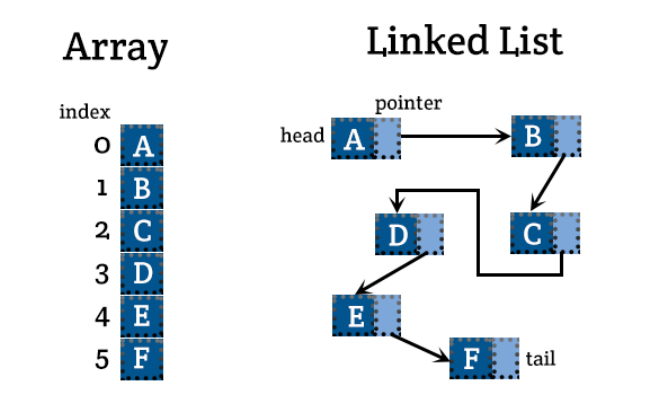

## 📓 키워드

- 맵

---

## ✏️ 맵(Map)

- 고유한 키를 기반으로 `키-값`쌍으로 이루어져 있는 정렬된 자료구조
- 삽입할 때마다 자동정렬됨
- 균형잡힌 이진탐색트리인 레드-블랙트리로 구현됨


#### ☑️ 시간복잡도

- 참조 : O(logN)
- 탐색 : O(logN)
- 삽입/삭제 : O(logN)



- 고유한 키를 갖기 때문에, 하나의 키에 중복된 값이 들어갈수 없음
- 자동으로 오름차순 정렬되기 때문에 넣은 순서대로 map을 탐색할 수 있는 것이 아닌 아스키코드순으로 정렬된 값들을 기반으로 탐색함
- `[]` 연산자로 해당키를 직접참조할 수 있음

```cpp
#include <bits/stdc++.h>
using namespace std;
map<string, int> mp;
string a[] = {"LG", "NC", "SSG"};
int main(){
    for(int i = 0; i < 3; i++){
        mp.insert({a[i], i + 1});
    }
    cout << mp["LG"] << '\n';
    cout << mp.size() << '\n';
    mp.erase("LG");
    auto it = mp.find("KT");
    if(it == mp.end()){
        cout << "맵에서 해당요소는 없습니다.\n";
    }
    
    // 이렇게도 삽입할 수 있습니다.
    mp["KT"] = 100;
    for(auto it : mp){
        cout << (it).first << " : " << (it).second << '\n';
    }
    mp.clear();
    cout << "map의 사이즈는 : " << mp.size() << "입니다.\n";
    return 0;
}

/*
1
3
맵에서 해당요소는 없습니다.
KT : 100
NC : 2
SSG : 3
map의 사이즈는 : 0입니다.
*/
```