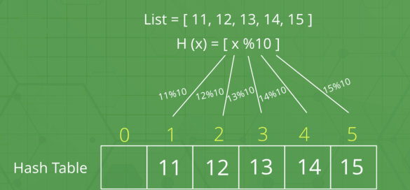
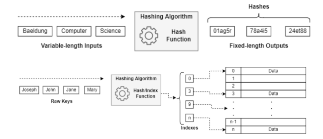
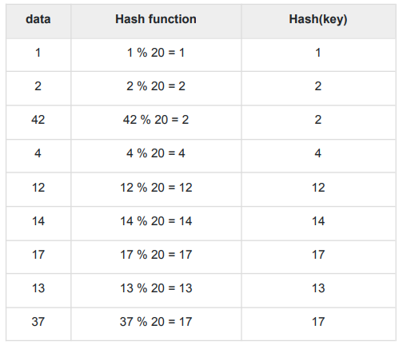
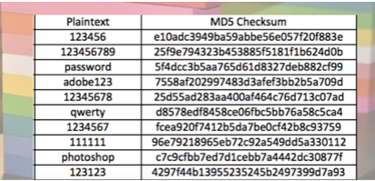
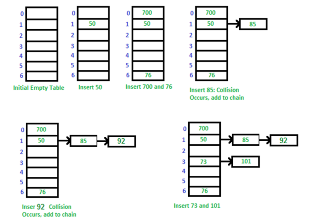

## 📓 키워드

- 해시테이블

---

## ✏️ 해시테이블(Hash Table)

- 큰 범위를 가진 각양각색의 데이터들을 해싱을 통해 한정된 범위의 정수값을 가진 해시로 만들고 해시라는 키에 대응하여 원본데이터들을 매핑시켜놓은 테이블



#### ☑️ 해시

- 다양한 길이를 가진 데이터를 고정된 길이를 가진 데이터로 매핑한 값

#### ☑️ 해싱

- 임의의 데이터를 해시로 바꿔주는 일이며 해싱함수가 이를 담당

#### ☑️ 해시함수

- 임의의 데이터를 입력으로 받아 일정한 길이의 데이터로 바꿔주는 함수



```javascript
let a = [1, 2, 42, 4, 12, 14, 17, 13, 37]
const hashf = num => num % 20
a = a.map(e => hashf(e))
console.log(a)

/*
[
1, 2, 2, 4, 12,
14, 17, 13, 17
]
*/
```



- 보통 해시함수는 `%`연산자가 들어가는 경우가 많다
- 숫자가 아닌 문자열을 기반으로 정수값의 해시를 만들기도 함(아스키코드)
```javascript
let a = ["dopa", "paka", "ralo"]
const hashf = (str, size) => {
    let hash = 3;
    for(let i = 0; i < str.length; i++){
        hash *= str.charCodeAt(i)
        hash %= size
    }
    return hash
}
a = a.map(e => hashf(e, 20))
console.log(a)
console.log('a'.charCodeAt(0))

// [ 0, 8, 12 ]
```

- 데이터베이스에서 개인정보를 암호화해서 저장할때 쓰이기도 함
  - MD5 : 레인보우 테이블을 통한 취약점이 있기 때문에 잘 안쓰임
  - bcrypt : 현대 데이터베이스에서 값을 암호화해서 저장할때 많이 쓰임

#### ☑️ 레인보우 테이블

- MD5, SHA1 등의 해시함수로 만들어낼 수 있는 모든 해시를 담은 테이블
- 이를 통해 MD5로 해싱된 비밀번호를 무식하게 탐색해서 뚫을수 있음



### 💭 시간복잡도

#### ☑️ 평균시간복잡도

- 해당 키를 기반으로 배열에서 인덱스로 접근하듯이 접근할 수 있음
- 참조 : O(1)
- 탐색 : O(1)
- 삽입/삭제 : O(1)

#### ☑️ 최악시간복잡도

- 해시테이블에서 충돌이 많이 일어난다면 해당 해시값이 같은 모든 요소들을 탐색해야함
- 참조 : O(N)
- 탐색 : O(N)
- 삽입/삭제 : O(N) 

### 💭 해시테이블의 충돌해결

- 같은 해시값이 나타나기 때문에 충돌문제가 발생

#### ☑️ Birthday Paradox

- 해시테이블의 충돌문제는 `거의 무조건` 발생함
- 아주 큰 테이블을 만든다 하여도 충돌이 발생할 확률이 높음
- 같은방에 생일이 같은 사람이 존재할 확률이 50%가 되려면 방에 23명이상만 있으면 가능

#### ☑️ 체이닝

- 충돌 시, 연결리스트에 할당하고 충돌시 연결리스트를 탐색하는 기법
- 구현이 간단하여 해시테이블에 많은 데이터를 넣을 수 있음
- 연결리스트 기반이라 캐시성능이 좋지 않음
- 체인이 길어지면 최악의 경우 O(N)



- 이때, 연결리스트뿐만 아니라 동적배열, 균형잡힌 트리인 레드블랙트리가 사용되며 Java8 이상에서는 요소의 수가 특정 임계값을 초과하게되면, 레드블랙트리를 HashMap에 사용함
- 이를 통해 O(N)의 시간복잡도를 O(logN)으로 개선

#### ☑️ 개방주소법

- 충돌 시, 다른 버켓에 데이터를 삽입하는 기법

- 선형탐색
    - 해시 충돌 시, 다음 버켓 혹은 몇개를 `선형적으로` 건너뛰어 데이터를 삽입
- 제곱탐색
  - 해시 충돌 시, 1부터 연속적인 수를 만들며 해당 수의 제곱만큼 건너뛴 버켓에 데이터를 삽입
- 이중해싱
  - 해시 충돌 시, 다른 해시함수를 한번 더 적용한 결과를 이용해서 데이터를 삽입
