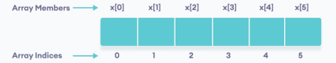

## 📓 키워드

- 정적배열(Array)
- 동적배열(Vector)

---

## ✏️ 정적배열(Array)

- 선언할 때 보통 크기를 설정해서 연산을 진행함
- 연속된 메모리 공간에 위치한 같은 타입의 요소들의 모음
- 숫자인덱스를 기반으로 랜덤접근이 가능하며 중복을 허용



```java
public static void main(String[] args){
    int[] a = {1,2,3};
    int[] a2 = {1,2,3,4};
    int[] a3 = new int[10];
    
    for(int i=0; i<3; i++){
        System.out.print(a[i] + " ");
    }
    System.out.println();
    
    for(int i; i<4; i++){
        System.out.print(a2[i] + " ");
    }
    System.out.println();
    
    for(int i : a2){
        System.out.print(i + " ");
    }
    System.out.println();
    
    for(int i=0; i<10; i++){
        a3[i] = i;
    }
    for(int i : a3){
        System.out.print(i + " ");
    }
}
/*
        1 2 3
        1 2 3 4
        1 2 3 4
        0 1 2 3 4 5 6 7 8 9
 */
```

---

## ✏️ 동적배열(Vector)

- 동적으로 요소를 할당할 수 있는 동적 배열
- 만약 컴파일 시점에 사용해야 할 요소들의 개수를 모른다면 vector를 사용해야함
- 연속된 메모리 공간에 위치한 같은 타입의 요소들의 모음이며 숫자인덱스를 기반으로 랜덤접근이 가능하며 중복을 허용
- 참조 : O(1), 탐색 : O(N)