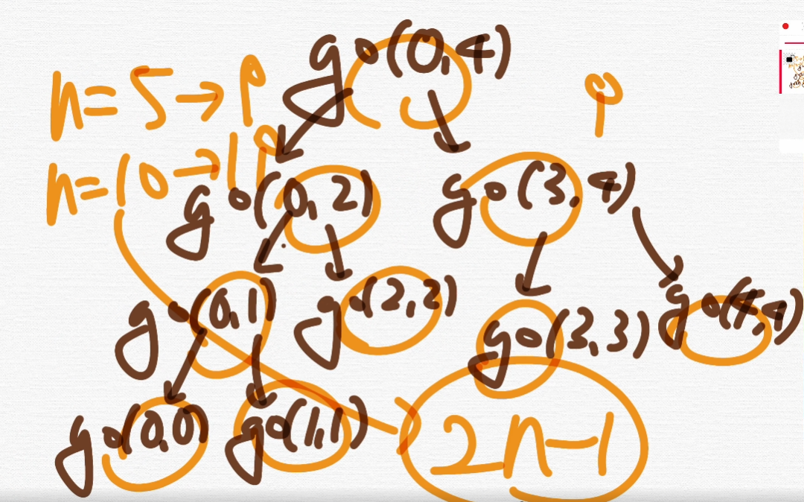
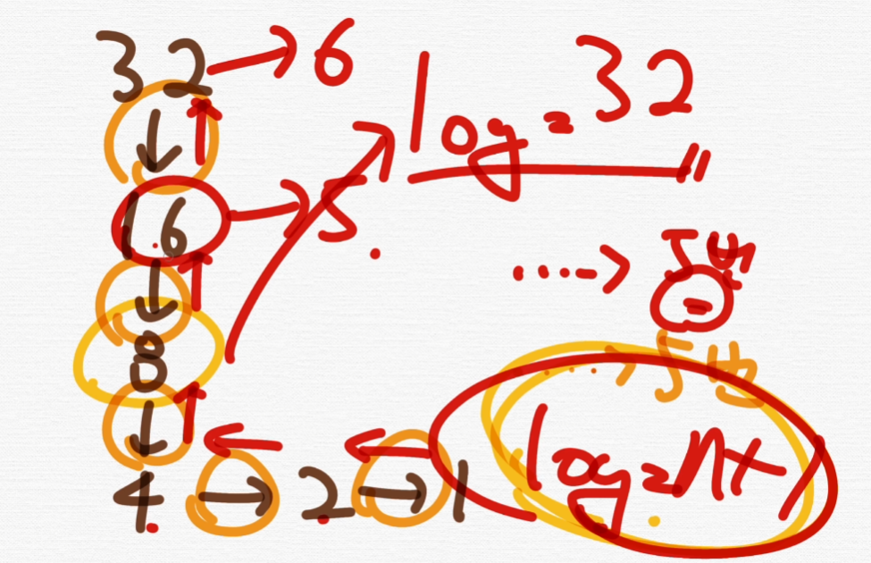
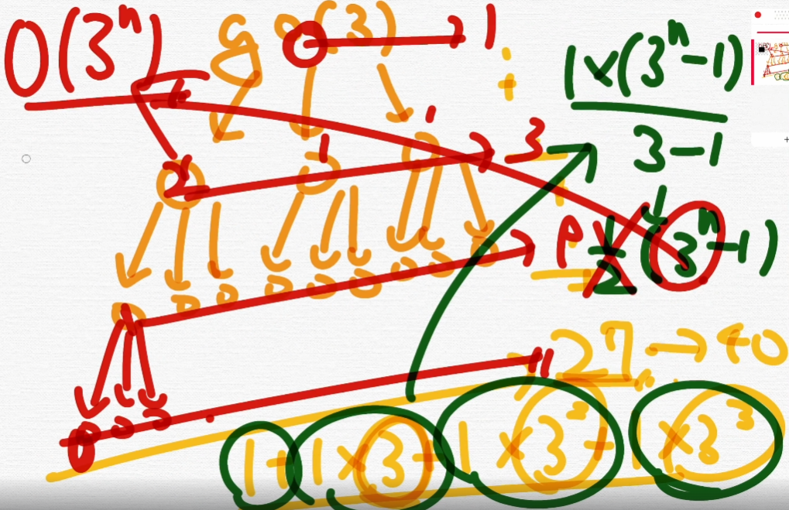
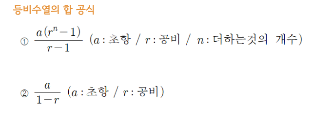

## 📓 키워드

- 시간복잡도
- 빅오표기법

---

#### ☑️ 자료구조

- 효율적으로 데이터를 관리하고 수정, 삭제, 탐색, 저장할 수 있는 데이터 집합

## ✏️ 시간복잡도

- 복잡도는 시간복잡도와 공간복잡도로 나뉘어짐
- 입력크기에 대해 어떠한 알고리즘이 실행되는데 걸리는 시간
- 주요로직의 반복횟수를 중점으로 측정됨

### 💭 빅오표기법

- 복잡도에 가장 영향을 많이 끼치는 항의 상수인자를 빼고, 나머지 항을 없애서 복잡도를 나타내는 표기법


#### ☑️ O(N<sup>2</sup>)

```java
public static void main(String[] args){
    Scanner sc = new Scanner(System.in);
    int n = sc.nextInt();
    int a = 0;
    
    for(int i=0; i<n; i++){
        for(int j=0; j<i; j++){
            a += i+j;
        }
    }
}
```

#### ☑️ O(N+M)

```java
public static void main(String[] args){
    solve(N, M);
}

public void solve(int N, int M){
    int a = 1;
    for(int i=0; i<N; i++){
        a *= i;
    }
    for(int j=0; j<M; j++){
        a *= j;
    }
}
```

#### ☑️ O(N)

```java
int n, cnt;
int[] a = new int[1004];

public static void main(String[] args){
    for(int i=1; i<=n; i++){
        a[i-1] = i;
    }
    int sum = go(0, n-1);
}

public int go(int l, int r){
    if(l == r){
        return a[1];
    }
    int mid = (l+r) / 2;
    int sum = go(l, mid) + go(mid+1, r);
    return sum;
}
```



#### ☑️ O(logN)

```java
public static void main(String[] args){
    Scanner sc = new Scanner(System.in);
    int N = sc.nextInt();
    solve(N);
}

public void solve(int N){
    int a = 0;
    int i = N;
    while(i>0){
        a += i;
        i /= 2;
    }
}
```

- 로그함수는 지수함수의 역함수이다
- 어떤 수를 나타내기 위해 고정된 밑을 몇번 곱하여야 하는지를 나타냄



#### ☑️ O(3<sup>n</sup>)

```java
public static void main(String[] args){
    Scanner sc = new Scanner(System.in);
    int N = sc.nextInt();
    solve(N);
}

public void solve(int N){
    if(N==0){
        return;
    }
    for(int i=0; i<3; i++){
        solve(N-1);
    }
}
```

- 재귀함수의 시간복잡도는 메인로직 * 함수호출



