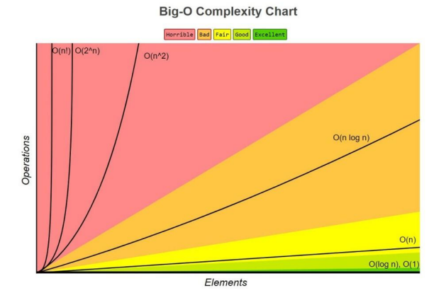

## 📓 키워드

- 시간복잡도
- 빅오표기법

---

#### ☑️ 자료구조

- 효율적으로 데이터를 관리하고 수정, 삭제, 탐색, 저장할 수 있는 데이터 집합

## ✏️ 시간복잡도

- 복잡도는 시간복잡도와 공간복잡도로 나뉘어짐
- 입력크기에 대해 어떠한 알고리즘이 실행되는데 걸리는 시간
- 주요로직의 반복횟수를 중점으로 측정됨

### 💭 빅오표기법

- 복잡도에 가장 영향을 많이 끼치는 항의 상수인자를 빼고, 나머지 항을 없애서 복잡도를 나타내는 표기법

