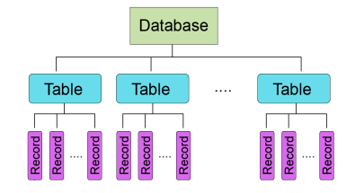

## 📓 키워드

- 엔티티
- 릴레이션
- 속성

---

## ✏️ 데이터베이스

---

- 일정한 규칙 혹은 규약을 통해 구조화되어 저장되는 데이터의 모음
- 데이터베이스를 관리하는 시스템을 `DBMS`라고 함
- 쿼리언어를 통해 데이터에 CRUD(Create/ Read/ Update/ Delete)가 가능함
- 트랜잭션, 동시공유, 사용자에 따른 데이터접근 권한부여, 데이터 암호화, 백업 및 복구 등이 가능함

---

### 💭 엔티티

- 데이터베이스에서 실제 세계의 객체나 개념을 모델링한 것
- DB내에서 하나의 고유하게 식별될 수 있는 속성을 가짐

#### ☑️ 약한 엔티티

- 독립적으로 존재할 수 없고 다른 강한 엔티티에 의존
- 자체적인 주요 키(PK)를 가지지 않으며, 관련 강한 엔티티의 키를 참조
  - ex) 강의 등록

#### ☑️ 강한 엔티티

- 자체적인 주요 키(PK)를 가지고 다른 엔티티에 의존하지 않는 독립적인 엔티티
  - ex) 학생

### 💭 릴레이션

- 데이터베이스에서 정보를 구분하여 저장하는 기본 단위이자 엔티티의 집합과 그 엔티티의 속성을 표현하는 구조
- 엔티티가 데이터베이스에 올라가면 릴레이션이 됨

#### ☑️ 테이블과 컬렉션의 차이

- MySQL(RDBMS) : 레코드 - `테이블` - 데이터베이스
- MongoDB(NoSQL) : 도큐먼트 - `컬렉션` - 데이터베이스
- 레코드가 쌓여서 테이블, 테이블이 쌓여서 데이터베이스가 되는 `계층적인 구조`

---

### 💭 속성

- 릴레이션에서 관리하는 구체적이며 고유한 이름을 갖는 정보
    - ex) 차라는 엔티티에는 {차번호, 바퀴 수, 색상}

#### ☑️ 도메인

- 릴레이션에 포함된 각각의 속성들이 가질 수 있는 값의 집합
    - ex) 성별이라는 속성 {남 / 여}

#### ☑️ 필드

- 엔티티가 데이터베이스에 들어갈 때 `엔티티의 속성`은 데이터베이스의 테이블의 필드로 변화되어 들어가게 됨
- 보통 영어로 변환하여 사용

#### ☑️ 레코드

- 필드를 가진 데이터들이 행단위로 쌓이게 되는데, 이를 `행단위의 데이터, 레코드, 튜플`라고 부름

---

