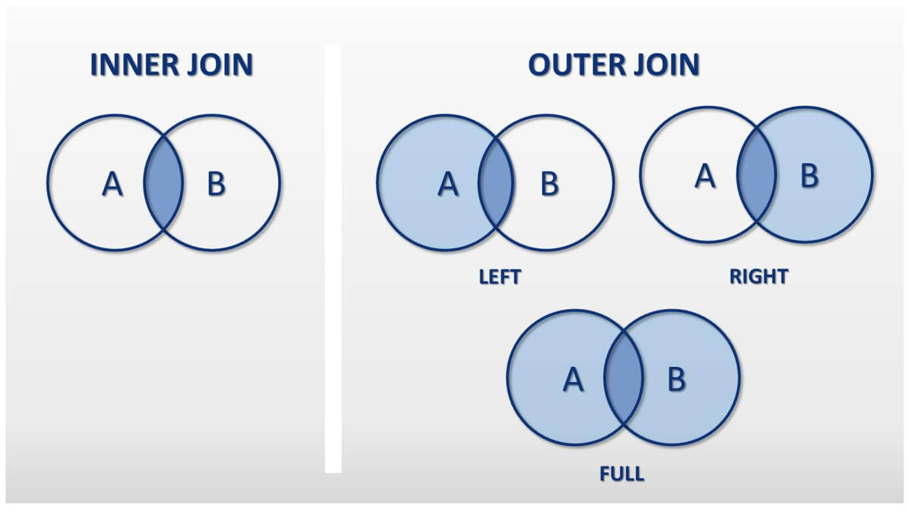
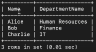
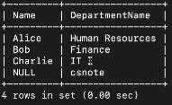
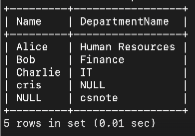
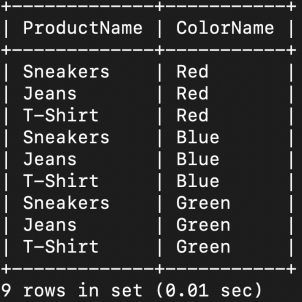

## 📓 키워드

- Inner Join
- Outer Join
- 

---

## ✏️ 조인

---

- 두 개 이상의 테이블을 연결하여 데이터를 탐색하는 방법
- MySQL은 JOIN이라는 쿼리로, MongoDB에서는 lookup이라는 쿼리로 이를 처리할 수 있음



### 💭 내부 조인(Inner Join)



- 두 테이블에서 일치하는 데이터만 반환(교집합)
- 테이블 A와 테이블 B사이에 모두 존재하는 데이터만 결과로 나타남

### 💭 왼쪽 외부 조인(Left Outer Join)


- 좌측 테이블의 모든 레코드와 우측 테이블의 일치하는 레코드를 반환
- 우측 테이블에 일치하는 레코드가 없다면, 결과는 좌측테이블의 레코드와 NULL값으로 구성됨

### 💭 오른쪽 외부 조인(Right Outer Join)



- 우측 테이블의 모든 레코드와 좌측 테이블의 일치하는 레코드를 반환
- 좌측 테이블에 일치하는 레코드가 없다면, 결과는 우측테이블의 레코드와 NULL값으로 구성됨

### 💭 전체 외부 조인(Full Outer Join)



- 두 테이블의 모든 레코드를 반환
- 한 테이블에만 존재하는 레코드는 다른 테이블에 해당하는 부분이 NULL값으로 구성됨

```sql
-- Employees 테이블 생성
CREATE TABLE Employees (
ID INT PRIMARY KEY,
Name VARCHAR(100),
DepartmentID INT
);

-- Departments 테이블 생성
CREATE TABLE Departments (
DepartmentID INT PRIMARY KEY,
DepartmentName VARCHAR(100)
);

-- Employees 테이블에 데이터 삽입
INSERT INTO Employees (ID, Name, DepartmentID) VALUES (1, 'Alice', 101),
                                                      (2, 'Bob', 102),
                                                      (3, 'Charlie', 103);

-- Departments 테이블에 데이터 삽입
INSERT INTO Departments (DepartmentID, DepartmentName) VALUES (101, 'Human Resources'),
                                                              (102, 'Finance'),
                                                              (103, 'IT');
INSERT INTO Departments (DepartmentID, DepartmentName) VALUES (105, 'csnote');

-- INNER JOIN
SELECT E.Name, D.DepartmentName
FROM Employees E
INNER JOIN Departments D ON E.DepartmentID = D.DepartmentID;
INSERT INTO Employees (ID, Name, DepartmentID) VALUES (4,'cris', 104);

-- LEFT JOIN
SELECT E.Name, D.DepartmentName
FROM Employees E
LEFT JOIN Departments D ON E.DepartmentID = D.DepartmentID;

-- RIGHT JOIN
SELECT E.Name, D.DepartmentName
FROM Employees E
RIGHT JOIN Departments D ON E.DepartmentID = D.DepartmentID;

-- mysql은 full outer지원이 안되서 union을 써야 함.
SELECT E.Name, D.DepartmentName
FROM Employees E
LEFT JOIN Departments D ON E.DepartmentID = D.DepartmentID
UNION
SELECT E.Name, D.DepartmentName
FROM Employees E
RIGHT JOIN Departments D ON E.DepartmentID = D.DepartmentID;
```

#### ☑️ 성능 차이

- 일반적으로 Inner Join이 Outer Join보다 빠르다
- Inner Join의 결과집합에는 양쪽 테이블에서 일치하는 행만 필요로 하기 때문에, 처리해야할 데이터가 상대적으로 적다
- 다만, 실제 성능은 쿼리, 데이터베이스 구조, 인덱스 구조등에 따라 달라질 수 있음

#### ☑️ inner join이 아니라 left outer join을 써야할 때는?


- 일치하는 데이터가 없는 경우에도 결과를 보고 싶을 때 사용

---

### 💭 교차 조인(CROSS JOIN)



- 두 개이상의 테이블에서 가능한 모든 행의 조합을 생성하는 방법
- 두 테이블 간에 어떠한 조인 조건이 없을 때 사용됨
- 두 테이블의 모든 행 간에 `카테시안 곱`을 형성
- 교차조인의 결과는 매우 많은 데이터를 생성하기 때문에 성능이 좋지 않음(주로 테스팅을 할 때 사용)

```sql
-- Products 테이블 생성
CREATE TABLE Products (
ProductID INT PRIMARY KEY,
ProductName VARCHAR(100)
);

-- Colors 테이블 생성
CREATE TABLE Colors (
ColorID INT PRIMARY KEY,
ColorName VARCHAR(100)
);

INSERT INTO Products (ProductID, ProductName) VALUES (1, 'T-Shirt');
INSERT INTO Products (ProductID, ProductName) VALUES (2, 'Jeans');
INSERT INTO Products (ProductID, ProductName) VALUES (3, 'Sneakers');
INSERT INTO Colors (ColorID, ColorName) VALUES (1, 'Red');
INSERT INTO Colors (ColorID, ColorName) VALUES (2, 'Blue');
INSERT INTO Colors (ColorID, ColorName) VALUES (3, 'Green');

-- 교차 조인을 통한 모든 상품-색상 조합 조회
SELECT Products.ProductName, Colors.ColorName
FROM Products
CROSS JOIN Colors;
```

### 💭 자연 조인(NATURAL JOIN)


- 두 테이블간의 동일한 이름을 가진 모든 열을 기반으로 조인하는 방법
- 명시적으로 조인조건을 지정할 필요없이, 두 테이블에서 이름이 같은 모든 열에 대해 내부조인을 수행
- 자연 조인은 교차조인에 비해 훨씬 적은 수의 행을 반환함. 따라서, 교차조인에 비해 성능이 보통 더 좋음

```sql
-- Customers 테이블 생성
CREATE TABLE Customers (
CustomerID INT PRIMARY KEY,
Name VARCHAR(100),
City VARCHAR(100)
);

-- Orders 테이블 생성
CREATE TABLE Orders (
OrderID INT PRIMARY KEY,
CustomerID INT,
OrderDate DATE
);

-- Customers 테이블에 데이터 삽입
INSERT INTO Customers (CustomerID, Name, City) VALUES (1, 'John Doe', 'New York');
INSERT INTO Customers (CustomerID, Name, City) VALUES (2, 'Jane Smith', 'Los Angeles');
INSERT INTO Customers (CustomerID, Name, City) VALUES (3, 'Emily Johnson', 'Chicago');

-- Orders 테이블에 데이터 삽입
INSERT INTO Orders (OrderID, CustomerID, OrderDate) VALUES (101, 1, '2024-01-10');
INSERT INTO Orders (OrderID, CustomerID, OrderDate) VALUES (102, 2, '2024-01-15');
INSERT INTO Orders (OrderID, CustomerID, OrderDate) VALUES (103, 3, '2024-01-20');

-- 자연 조인을 통한 고객별 주문 정보 조회
SELECT *
FROM Customers
NATURAL JOIN Orders;
```