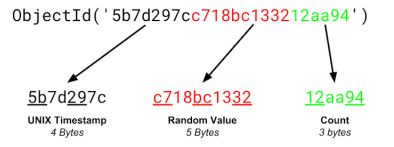
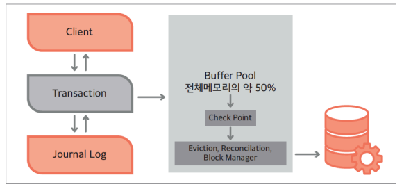

## 📓 키워드

- MongoDB
- WiredTiger 스토리지 엔진
- ObjectID
- BSON

---

## ✏️ MongoDB

- MongoDB는 JSON을 통해 데이터에 접근할 수 있고, BSON(Binary JSON)으로 데이터가 저장되는 도큐먼트 기반의 데이터베이스
- 스키마를 정해 놓지않고 유연하게 데이터를 삽입할 수 있기 때문에 다양한 도메인의 데이터베이스를 기반으로 분석하거나 로깅등을 구현할 때 강점을 보임

### 💭 MongoDB의 주요 특징

#### ☑️ 1. 기본키 : ObjectID



- MongoDB는 도큐먼트를 생성할 때마다 다른 컬렉션에서 중복된 값을 지니기 힘든 유니크한 값이며 기본키인 `ObjectID`가 생성됨
- 이는 유닉스 시간 기반의 `타임스탬프(4바이트), 랜덤값(5바이트), 카운터(3바이트)`로 이루어짐

#### ☑️ 2. BSON

- MongoDB는 클라이언트와 서버간에 데이터를 주고 받을 때 주로 JSON 형식을 사용함
- 하지만 내부적으로 데이터를 저장하고 처리할 때는 BSON(Binary JSON) 형식을 사용함
- BSON은 JSON의 확장된 이진형식으로, 추가적인 데이터 타입을 지원함
- BSON은 JSON과 유사하지만, 바이너리 형식의 데이터를 포함할 수 있으며, 더 많은 데이터 타입을 지원함
- 이 바이너리 형식 덕분에 MongoDB는 효율적으로 데이터를 저장할 수 있음
```json
db.users.updateOne({_id: "user123"}, {$set: {email:"newemail@example.com"});
```

#### ☑️ 3. 확장성

- MongoDB는 샤딩을 통한 수평적확장을 지원하며, 확장성을 염두에 두고 설계됨
- 샤딩은 데이터를 여러 서버에 분산시켜 단일서버에 대한 부하를 줄이고 대규모 데이터셋에 걸쳐 쿼리성능을 향상시킴

#### ☑️ 4. 2차원 좌표 인덱싱

- MongoDB는 2D sphere index를 써서 2차원 좌표를 인덱싱할 수 있음

#### ☑️ 5. 트랜잭션



- 체크포인트
  - MongoDB는 60초 간격으로 체크포인트를 생성
  - 또한 MongoDB가 종료되거나 새로운 체크포인트를 작성하는 동안 오류가 발생하더라도 다시 시작하면 MongoDB는 마지막 유효한 체크포인트에서 복구할 수 있음
  - 체크포인트를 기반으로 복구가능
- 저널링
  - 로깅이라고 부를 수 있는 저널링이 가능
  - 체크포인트 간의 모든 데이터 수정사항을 유지함
  - MongoDB가 체크포인트 사이에 종료되면 저널을 사용하여 마지막 체크포인트 이후 수정된 모든 데이터를 재생산 할 수 있음

### 💭 MongoDB 사용시 주의할 점

#### ☑️ 1. 크기

- MongoDB는 RDBMS와 달리 스키마 없이 데이터 모델을 구현하지 않은 채 유동적으로 데이터를 삽입할 수 있음
- 하지만 스키마를 미리 설정해놓고 DB에 저장하는 RDBMS는 칼럼의 길이가 DB에 저장되지 않지만 MongoDB는 다름
- key-value 형태로 DB에 저장될 때 해당 key의 길이도 매번 저장됨
  - ex) RDBMS의 경우 어떤 한 스키마가 int, char[14]인 경우 그 안에 들어가는 데이터인 18바이트만 저장이 되지만,
  - MongoDB의 경우 한 도큐먼트로 칼럼이름도 바이트에 추가됨 comments : string이란 type으로 정해놓고 DB에 저장한다면 comments라는 길이의 byte인 8바이트가 각각 더 들어가게 됨

#### ☑️ 2. 메모리

- MongoDB의 WiredTiger 스토리지 엔진은 서버의 총 RAM의 약 50%를 캐시로 사용하도록 설정됨
- 여기서 중요한 것은 WiredTiger 캐시가 시스템 전체 메모리의 절반을 사용한다는 점이 아니라, 사용 가능한 메모리에서 1GB를 뺀 후의 절반을 사용함
  - ex) 4GB일때, (4GB - 1GB) * 0.5 = 1.5GB
  - 최소메모리는 256MB가 필요함. 만약 시스템에 1.25GB의 RAM이 있다면 (1.25GB - 1GB) * 0.5 = 128MB이지만, 최소캐시 할당량인 256MB보다 작으므로, WiredTiger는 캐시에 256MB를 할당함
