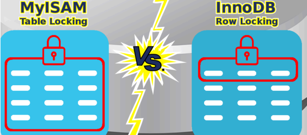

## 📓 키워드

- InnoDB
- MyISAM

---

## ✏️ InnoDB & MyISAM 스토리지엔진의 차이

- 데이터베이스의 스토리지 엔진은 데이터베이스 시스템에서 데이터의 저장, 검색, 트랜잭션 관리, 동시성 제어, 캐싱 등 핵심 구성요소이다.
- InnoDB는 MySQL 8.0의 기본 스토리지 엔진이다.
- MyISAM으로 변경이 가능하긴 하지만 InnoDB가 더 좋다.

|      특성      |     InnoDB     |  MyISAM  |
|:------------:|:--------------:|:--------:|
|   트랜잭션 지원    | 지원(ACID 특성 지원) |   미지원    |
|   락 및 동시성    |     행 레벨 락     | 테이블 레벨 락 |
|    외래키 제약    |       지원       |   미지원    |
| Full-Text 검색 |      미지원       |    지원    |