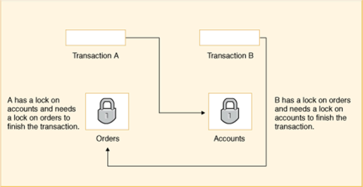
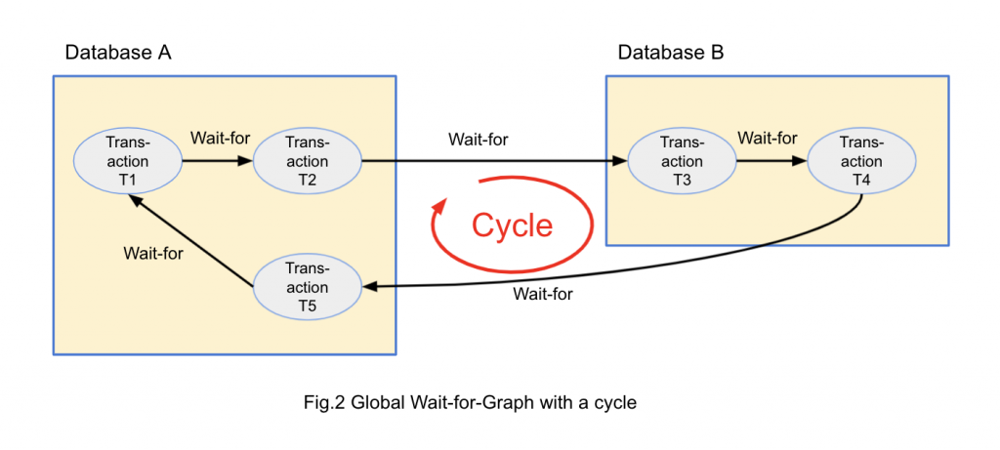

## 📓 키워드

- 데드락
- timeout
- wait-die
- wound-wait

---

## ✏️ 데드락

- 둘 이상의 트랜잭션이 서로가 잠금을 포기하기를 기다리는 상황(=교착상태)

### 💭 발생조건

- 다음 조건들이 동시에 충족될 때 발생

- `상호배제(Mutual Exclusion)` : 자원은 한번에 하나의 트랜잭션만 사용할 수 있다
- `점유 및 대기(Hold and Wait)` : 트랜잭션이 최소한 하나의 자원을 점유하고 있으면서 다른 트랜잭션이 점유한 자원을 추가로 요구할때 발생
- `비선점(No Preemption)` : 한 트랜잭션이 점유한 자원은 그 트랜잭션이 명시적으로 해제할때까지 다른 트랜잭션에 의해 강제로 빼앗길 수 없음
- `순환 대기(Circular Wait)` : 각 트랜잭션이 순환적으로 다음 트랜잭션에 의해 점유된 자원을 대기하는 상태

### 💭 해결방법(데드락 탐지)

#### ☑️ 1. timeout

- 일정시간 이후 트랜잭션이 실행되지 않았을 경우 롤백을 함
- 직접적으로 탐지하는것은 아니지만 일정시간 이후 트랜잭션이 실행되지 않음을 교착상태로 정의해서 탐지하는 방법
- 장점 : 구현이 간단하고 데드락 상황을 빠르게 해결할 수 있음
- 단점
  - 타임아웃 시간 설정이 어려움
  - 너무 짧으면 불필요한 중단이 발생할 수 있고 너무 길면 데드락을 해결하는데 시간이 오래걸림
  - 실제 데드락이 아닌 상황에서도 트랜잭션이 중단될 수 있음

#### ☑️ 2. wait for graph

- 트랜잭션에 관한 대기그래프를 만들고 해당 그래프에 사이클이 발생됨을 주기적으로 검사

- 대규모 데이터베이스의 경우 모든 트랜잭션의 사이클을 찾아 데드락을 감지하는 것은 코스트가 크다
- 보통은 timeout과 데드락방지방법을 사용함

### 💭 해결방법(데드락 방지)

- 애초에 최대한 데드락이 일어나지 않게 방지하는 것

#### ☑️ 1. 격리수준 변경

- 데드락을 방지하기 위해 격리수준을 조정하는 것
- REPEATABLE_READ => serializable로 변경
- 다만, serializable이 아닌 이상 모든 데드락을 제거할 수는 없음

#### ☑️ 2. 자원 할당 순서 지정(Ordering of Resource Allocation)

- 서비스 로직을 구축할 때 자원할당이 교착상태가 발생하지 않도록 서비스의 논리구조를 바꾸는 것

#### ☑️ 3. wait-die 방법

- 타임스탬프를 기반으로 오래된 트랜잭션을 좀 더 우선순위가 높다고 판정하여 이에 따라 대기, 강제종료 등을 하는 방식을 가진 `비선점기법`
- 기다림(Wait)
  - 우선순위가 높은 트랜잭션이 자원을 요청했을 때, 그 자원이 이미 낮은 트랜잭션에 의해 점유되어 있으면, 우선순위가 높은 트랜잭션은 대기상태로 들어감
- 죽음(Die)
  - 우선순위가 낮은 트랜잭션이 자원을 요청했을 때, 그 자원이 이미 우선순위가 높은 트랜잭션에 의해 점유되어 있으면, 우선순위가 낮은 트랜잭션은 롤백되고 나중에 다시 시도함

#### ☑️ 4. wound-wait

- 타임스탬프를 기반으로 오래된 트랜잭션을 좀 더 우선순위가 높다고 판정하여 이에 따라 대기, 강제종료 등을 하는 방식을 가진 `선점기법`
- 부상(Wound)
  - 우선순위가 높은 트랜잭션이 자원을 요청했을 때, 그 자원이 이미 우선순위가 낮은 트랜잭션에 의해 점유되어 있으면, 우선순위가 낮은 트랜잭션을 부상시킴
  - 해당 트랜잭션의 점유자원을 강제해제하고 우선순위가 높은 트랜잭션에게 넘겨줌
- 대기(Wait)
  - 우선순위가 낮은 트랜잭션이 자원을 요청했을 때, 그 자원이 이미 우선순위가 높은 트랜잭션에 의해 점유되어 있으면, 우선순위가 낮은 트랜잭션은 높은 우선순위를 가진 트랜잭션이 해제될때까지 기다림