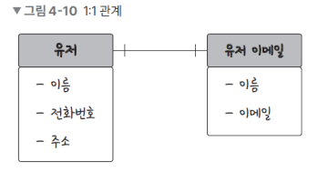
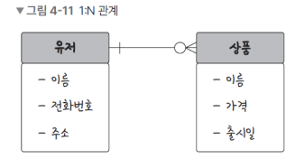
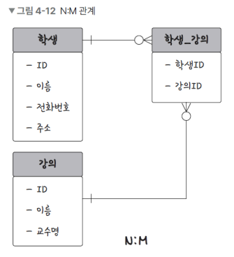
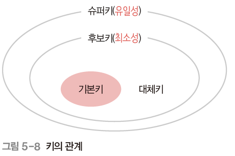
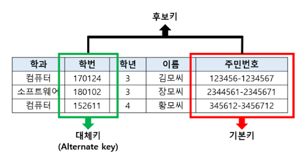

## 📓 키워드

- 관계
- 기본키
- 외래키
- 후보키
- CRUD

---

## ✏️ 관계

---


### 💭 1:1



- 회원가입 시, 유저와 이메일의 관계

### 💭 1:N



- 쇼핑몰사이트의 유저와 장바구니에 담은 상품의 관계

### 💭 N:M



- 학생과 강의의 관계
- 직접적으로 연결하지 않고 1:N, 1:M 이라는 관계를 갖는 테이블 2개로 나눠서 설정

---

## ✏️ 키(key)

---

- 데이터베이스를 설계할 때, 키를 기반으로 테이블 간의 관계를 정의
- 키의 종류 : 기본키, 외래키, 대체키, 후보키, 슈퍼키, 복합키



> `유일성` : 중복되는 값 없다<br>
> `최소성` : 필드를 조합하지 않고, 최소 필드만 써서 키를 형성할 수 있는 것

### 💭 기본키

- Primary Key(PK)
- 유일성과 최소성을 만족하면서 테이블의 각 행을 고유하게 식별하는 필드
- 각 테이블에는 하나의 기본키만 존재한다
- 기본키는 보통 자연키와 인조키중 골라서 설정하며, 보통은 인조키로 설정함

```sql
CREATE TABLE Students(
    StudentID INT NOT NULL,
    Name VARCHAR(100),
    -- 기본키 설정
    PRIMARY KEY (StudentID)
);
```

#### ☑️ 자연키

- 존재하고, 실제로 의미 있는 필드를 사용하여 테이블의 행을 고유하게 식별하는 키
- 데이터 내에서 발견되는 유일한 값이자 의미있는 정보를 담고있음
- 언젠가는 변하는 속성을 지녀 나중에 문제를 발생시킬 수 있음
  - ex) 주민등록번호(1994년 생인데 나중에 2094년이 되면?)

#### ☑️ 인조키

- 테이블의 행을 식별하기 위해 특별히 생성된, 일반적으로 숫자로 이루어진 고유하게 식별하는 키
- 테이블 내에서 자동생성되며, 일반적으로 아무런 실질적인 의미를 가지지 않음
```sql
CREATE TABLE socks(
    -- AUTO_INCREMENT
    id INT NOT NULL AUTO_INCREMENT
);
```

### 💭 외래키


- Foreign Key
- 다른 테이블의 기본키를 참조하는 필드
- 외래키는 참조하는 기본키의 값과 일치해야하며 중복될 수 있고, NULL값을 가질 수도 있음

### 💭 대체키

- 기본키로 선택되지 않은 후보키

### 💭 후보키



- 기본키가 될 수 있는 후보들
- 유일성과 최소성을 모두 만족하는 키

### 💭 슈퍼키

- 테이블 내의 행을 고유하게 식별할 수 있는 유일성을 갖춘 키

### 💭 복합키

- 두 개 이상의 필드를 조합하여 만든 키
- 필드 단독으로는 행을 고유하게 식별하지 못하지만, 조합할 경우 식별이 가능

---

## ✏️ CRUD

---

### 💭 CREATE

```sql
-- 테이블 생성
CREATE TABLE employees(
    id INT AUTO_INCREMENT PRIMARY KEY,
    name VARCHAR(100),
    position ENUM('Software Engineer', 'Project Manager', 'Designer'),
    skills SET('Java', 'Python', 'SQL', 'Design', 'Management'),
    salary DECIMAL(10, 2)
);

-- 데이터 삽입
INSERT INTO employees(name, position, skills, salary) VALUES ('John Doe', 'Software Engineer', 'Java,Python', 60000.00),
                                                             ('Jane Smith', 'Project Manager', 'SQL,Management', 75000.00),
                                                             ('Emily Davis', 'Designer', 'Design', 70000.00);
```

### 💭 READ
```sql
-- 데이터 전체 조회
SELECT * FROM employees;

-- 데이터 조건부 조회
SELECT * FROM employees WHERE position = 'Software Engineer';
SELECT * FROM employees WHERE FIND_IN_SET('Java', skills);
```

### 💭 UPDATE
```sql
UPDATE employees SET salary = 80000.00 WHERE name = 'John Doe';
```

### 💭 DELETE
```sql
-- 데이터 삭제
DELETE FROM employees WHERE name = 'Emily Davis';

-- 테이블 삭제
DROP TABLE employees;
```