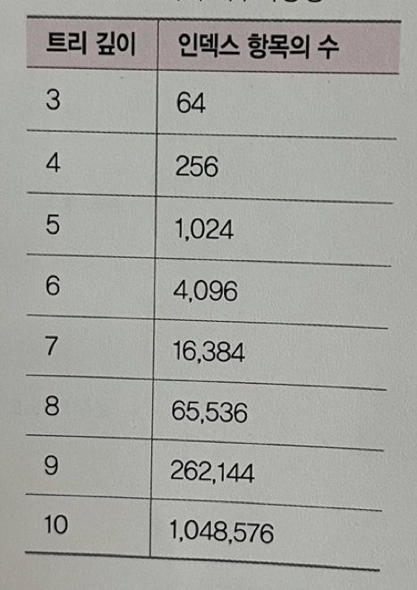

## 📓 키워드

- 

---

## ✏️ 인덱스

- 데이터를 빠르게 찾을 수 있는 하나의 장치

---

### 💭 인덱스가 효율적인 이유

- 균형잡힌 B-Tree기반으로 구축되어있어서 탐색에 평균 O(logN) 시간이 걸리며 트리 생성시의 대수확장성이란 특징으로 인해 더 빠른 시간안에 많은 양의 데이터를 빠르게 찾을 수 있음

#### ☑️ B-Tree

- 이진 트리를 확장해 하나의 노드가 가질 수 있는 자식노드의 최대숫자가 2보다 큰 트리구조

#### ☑️ 이진트리

- 각각의 노드가 최대 2개의 자식노드를 가지는 트리 자료구조

#### ☑️ 대수확장성

- 트리 깊이가 리프노드 수에 비해 매우 느리게 성장하는 것
- 트리의 깊이가 1개씩 증가하면 최대 인덱스 항목의 수는 4배씩 증가한다.

### 💭 인덱스 최적화 기법

#### 1. 인덱스는 비용이다

- 인덱스는 두번탐색을 강요함
- 인덱스 리스트, 컬렉션 순으로 탐색하기 때문이며 관련 읽기 비용이 들게 됨
- 쿼리에 있는 필드에 인덱스를 무작정 다 설정하는것은 답이 아님

#### 2, 항상 테스팅하라

- 인덱스 최적화 기법은 서비스 특징에 따라 다름
- 인덱스를 만들고 쿼리를 보낸 이후에 테스팅을 하며 걸리는 시간을 최소화해야 함

#### 3. 복합 인덱스는 같음 => 정렬 => 다중값 => 카디널리티 순

- 여러필드를 기반으로 조회를 할때 복합 인덱스를 설정하는데, 이 인덱스를 생성할 때는 순서가 있고 생성순서에 따라 인덱스 성능이 달라짐
- 같음 => 정렬 => 다중값 => 카디널리티 순으로 생성해야 함
> (1) 어떠한 값과 같음을 비교하는 ==이나 equal이라는 쿼리가 있다면 제일 먼저 인덱스로 설정 
> (2) 정렬에 쓰는 필드라면 그 다음 인덱스로 설정 
> (3) 다중 값을 출력해야 하는 필드, 즉 쿼리 자체가 >이거나 < 등 많은 값을 출력해야 하는 쿼리에 쓰는 필드라면 나중에 인덱스를 설정 
> (4) 유니크한 값의 정도를 카디널리티라고 함. 이 카디널리티가 높은 순서를 기반으로 인덱스를 생성해야 함

---

### 💭 Clustered Index와 Non Clustered Index의 차이

#### ☑️ Clustered Index

- 유일성과 최소성을 가지는 기본키 중 하나로 설정
- 테이블당 1개, 보통 테이블의 기본키가 클러스터형 인덱스가 됨
- 데이터페이지가 정렬되서 저장되며 인덱스 페이지의 리프노드에 `데이터페이지`가 들어가 있음
- 정렬되었기 때문에 탐색에 장점
- 데이터가 추가될 때마다 다시 모든 테이블을 정렬해야 하기 때문에 삽입, 삭제, 수정이 느림
- 인덱스의 순서와 데이터 순서가 일치함

#### ☑️ Non Clustered Index

- 보조인덱스라고 함
- 1개가 아닌 여러개를 만들 수 있음
- 클러스터형과는 달리 인덱스페이지 리프노드에 실제 데이터가 있는 것이 아니라 데이터페이지에 관한 포인터가 있음
- 정렬되어있지 않아서 탐색은 느리나, 삽입, 삭제, 수정이 빠름
- 인덱스의 순서와 데이터의 순서가 일치하지 않음