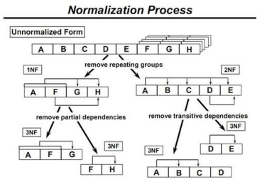
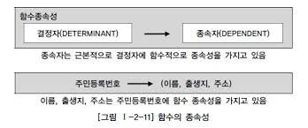
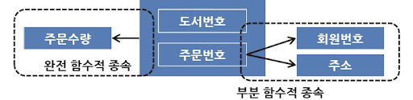
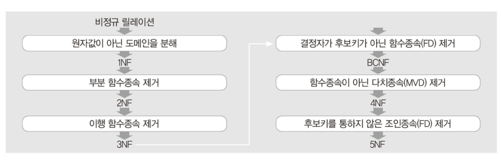
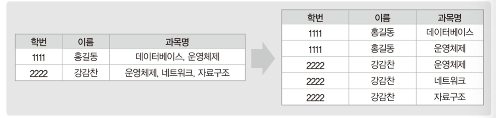
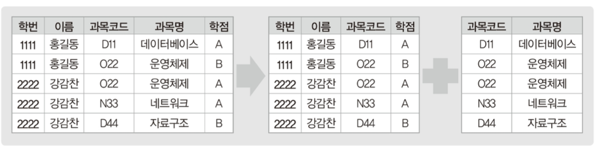
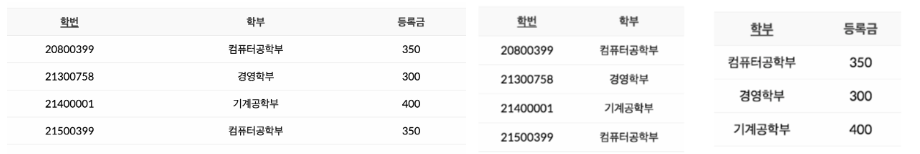
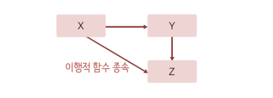
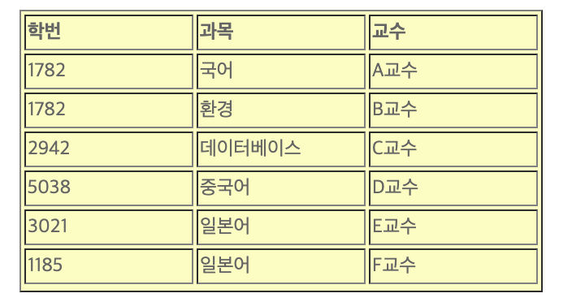

## 📓 키워드

- 정규화
- 이상현상

---

## ✏️ 정규화

- 릴레이션 간의 잘못된 함수종속 관계로 인해 데이터베이스 `이상현상이 일어나는 것을 해결하는 과정`
- 저장공간을 효율적으로 사용하기 위해 릴레이션을 여러개로 분리하는 과정
- 릴레이션간의 관련성을 `함수 종속성`을 통해 파악하고 이를 기준으로 릴레이션을 분리하는 정규화 과정을 진행해야 함

---

### 💭 이상현상

- 불필요한 데이터의 중복이 발생하여 릴레이션에 대한 `삽입, 갱신, 삭제` 연산을 수행할 때 부작용이 발생하는 것
- 관련없는 속성들이 하나의 릴레이션에 모였을때 발생
     
#### ☑️ 삽입이상

- 불필요한 데이터도 같이 삽입되는 것

#### ☑️ 갱신이상

- 중복 레코드가 있고, 전체가 변경되어야 하는데 이 중 일부만 변경되어 데이터 자체가 불일치 되는 현상

#### ☑️ 삭제이상

- 레코드를 삭제하는데 필요한 데이터까지 함께 삭제되는 현상

---

### 💭 함수적 종속성

- 하나의 X에 대해 Y가 하나라면 `X가 Y를 결정한다 또는 Y가 X에 함수적으로 종속되어있다`는 관계를 갖는 것
- X는 결정자, Y는 종속자
- 릴레이션 속성 값을 기반으로 결정하면 안되고, 속성자체의 특성을 기반으로 결정
- X가 기본키나 후보키가 아니어도 가능

#### ☑️ 완전함수종속

- Y가 X 전체에 종속된 것

#### ☑️ 부분함수종속

- Y가 X 일부에 종속된 것

---

### 💭 정규화 과정

- `도부이결다조`
- 분해한 릴레이션은 조인이 가능해야 하고, 조인되었을 때 분해전의 릴레이션들로 완벽히 복원되야 함
- 분해했을 때, 정보손실이 발생하지 않아야 함(`무손실분해`)

### 💭 제 1정규화

- 도메인이 원자값이게 만드는 것
- 릴레이션의 속성 값 중에서 한개의 기본키에 대해 두개 이상의 값을 가지는 반복집합이 있다면 제거하는 것
- {과목명}

### 💭 제 2정규화

- 부분 함수 종속을 제거
- {학번, 과목코드} => 과목명

### 💭 제 3정규화

- 이행적 함수 종속 제거
- 학번 -> 학부 -> 등록금

#### ☑️ 이행적 함수 종속

### 💭 보이스-코드 정규화

- 결정자이면서 후보키가 아닌 것 제거
- {학번, 과목}이 후보키일 때 {교수}는 후보키가 아님에도 {과목}을 결정하는 결정자 역할을 함
- {학번, 교수}, {과목, 교수} 릴레이션으로 나눔