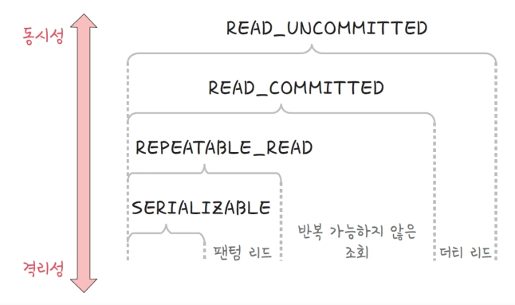
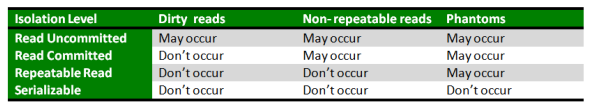
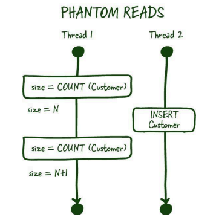
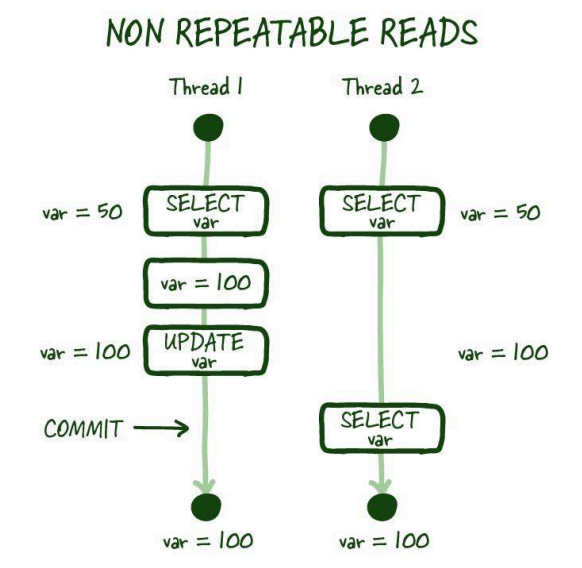
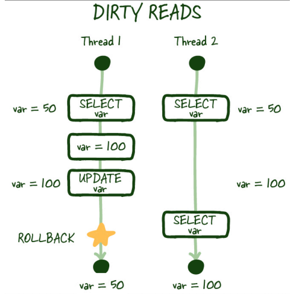

## 📓 키워드

- 트랜잭션
- ACID
- 격리수준
- 팬텀리드
- 더티리드

---

## ✏️ 트랜잭션

- 데이터베이스에 하나의 논리적 기능을 수행하기 위한 작업의 단위(쿼리를 묶는 단위)

#### ☑️ 커밋

- 여러 쿼리가 성공적으로 처리되었다고 확정하는 명령어
- 트랜잭션 단위로 수행되며 변경된 내용이 모두 영구적으로 저장

#### ☑️ 롤백

- 트랜잭션으로 처리한 하나의 묶음 과정을 일어나기 전으로 돌리는 일(취소)

#### ☑️ 트랜잭션 전파

- 트랜잭션을 수행할 때 커넥션 단위로 수행하기 때문에 커넥션 객체를 넘겨서 수행해야 하는데 이를 넘겨서 수행하지 않고, 여러 트랜잭션 관련 메소드의 호출을 하나의 트랜잭션에 묶이도록 하는 것

---

### 💭 트랜잭션의 특징(ACID)

- `원자성(Atomicity)`
  - All or Nothing
  - 트랜잭션과 관련된 일이 모두 수행되었거나 되지 않았거나를 보장하는 특징
- `일관성(Consistency)`
  - 허용된 방식으로만 데이터를 변경해야 하는 것
- `격리성(Isolation)`
  - 트랜잭션 수행 시 서로 끼어들지 못하는 것
- `지속성(Durability)`
  - 성공적으로 수행된 트랜잭션은 영원히 반영되어야 하는 것

#### ☑️ 무결성

- 데이터의 정확성, 일관성, 유효성을 유지하는 것

### 💭 격리성

- 격리성에는 여러 단계가 존재한다
- 각 단계마다 격리성과 동시성의 정도가 다르다
- 트랜잭션이 순차적으로 실행되면 격리성은 높아지지만 동시성은 낮아져서 성능이 떨어짐
- 격리성과 동시성은 반비례관계
- DB에서 이 단계를 조정 가능

```sql
-- MYSQL에서 격리성 단계 조절
set session transaction isolation level read uncommitted;
```



### 💭 격리수준에 따른 이상현상



#### ☑️ 팬텀 리드(Phantom Reads)



- 한 트랜잭션 내에서 동일한 쿼리를 2번 이상 보냈을 때 해당 조회결과가 다른 것

#### ☑️ 반복 가능하지 않은 조회(Nonrepeatable Reads)



- 한 트랜잭션 내의 같은 행을 두번 이상조회가 발생했는데, 그 값이 다른 것

#### ☑️ 더티 리드(Dirty Reads)



- 하나의 트랜잭션이 다른 트랜잭션의 아직 커밋되지 않은 데이터를 읽는 현상

### 💭 트랜잭션의 격리수준

#### ☑️ Serializable

- 커밋 완료된 데이터에 대해서만 조회할 수 있으며 트랜잭션을 순차적으로 진행시키는 것
- 여러 트랜잭션이 같은 행에 접근할 수 없음

#### ☑️ Repeatable Read

- 커밋 완료된 데이터에 대해서만 조회할 수 있으며 반복해서 행을 조회하더라도 똑같은 행을 보장하는 단계
- 하나의 트랜잭션이 수정한 행을 다른 트랜잭션이 수정할 수 없도록 막아주지만 새로운 행을 추가하는 것은 막지 않음
- 따라서, 똑같은 범위 쿼리를 실행했을 때, 이후에 추가된 행이 발견될 수 있음
- 팬텀리드가 일어날 수 있는 상태
- MySQL 8.0의 innoDB의 기본값

#### ☑️ Read Committed

- 커밋 완료된 데이터에 대해서만 조회할 수 있으며 커밋이 되지 않은 정보는 읽지 못함
- 팬텀리드, 반복가능하지 않은 조회가 일어날 수 있음
- PostgreSQL, SQL Server, Oracle에서의 기본값

#### ☑️ Read Uncommitted

- 가장 낮은 격리 수준이며 가장 빠르다
- 다른 트랜잭션이 커밋하지 않은 정보를 읽을 수 있음
- 팬텀리드, 반복 가능하지 않은 조회, 더티리드가 일어날 수 있음
- MongoDB의 기본값