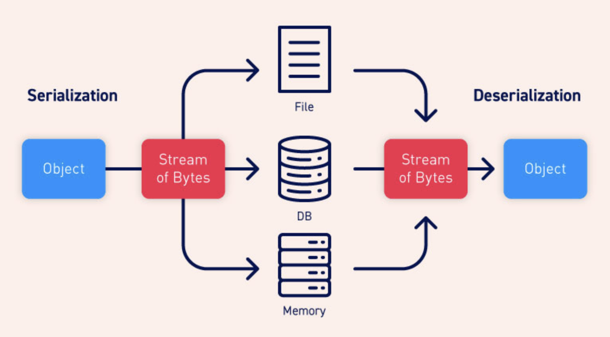

## 📓 키워드

- JSON
- 직렬화 / 역직렬화

---

## ✏️ JSON

- JavaScript Object Notation
- Javascript 객체 문법으로 구조화된 `데이터교환형식`
- python, javascript, java 등 여러 언어에서 데이터교환형식으로 사용
- `{key : value}`

```json
{
  "name" : "dongho",
  "age" : 29
}
```

- 이미 존재하는 키를 중복선언하면 나중에 선언한 해당 키에 대응한 값이 덮어쓰임
- 데이터 + 교환 형식
- 여러언어에서 사용(객체, 해시테이블, 딕셔너리)
- 단순배열, 문자열 표현 가능

### 💭 JSON의 타입

- Javascript Object와 유사하지만 undefined, 메서드 등을 포함할 수 없음
- Number, String, Boolean, Array, Object, null

### 💭 JSON의 활용

- JSON은 프로그래밍 언어와 프레임워크 등에 독립적이므로, 서로 다른 `시스템간에 데이터를 교환` 하는데 사용
- API의 반환형태, 시스템을 구성하는 설정파일(package.json)에 활용

---



### 💭 직렬화

- 외부의 시스템에서도 사용할 수 있도록 바이트 형태로 데이터를 변환하는 기술
- 객체 => 문자열
- `JSON.stringify()`

### 💭 역직렬화

- JSON을 객체로 변환하는 기술
- 문자열 => 객체
- `JSON.parse()`
- `JSON.loads()`(파이썬)

```javascript
const arr = [
  {
    "name" : "kim",
    "age" : 30,
    "lang" : "java"
  },
  {
    "name" : "lee",
    "age" : 33,
    "lang" : "python"
  },
  {
    "name" : "jang",
    "age" : 26,
    "lang" : "kotlin"
  },
];

// 1. 직렬화
const str = JSON.stringify(arr);
console.log(str)
/*
"[{"name":"kim","age":30,"lang":"java"},{"name":"lee","age":33,"lang":"python"},{"name":"jang","age":26,"lang":"kotlin"}]"
*/

// 2. 역직렬화
const obj = JSON.parse(str);
console.log(obj);
/*
[
  { name: 'kim', age: 30, lang: 'java'},
  { name: 'lee', age: 33, lang: 'python'},
  { name: 'jang', age: 26, lang: 'kotlin'}
]
*/
```