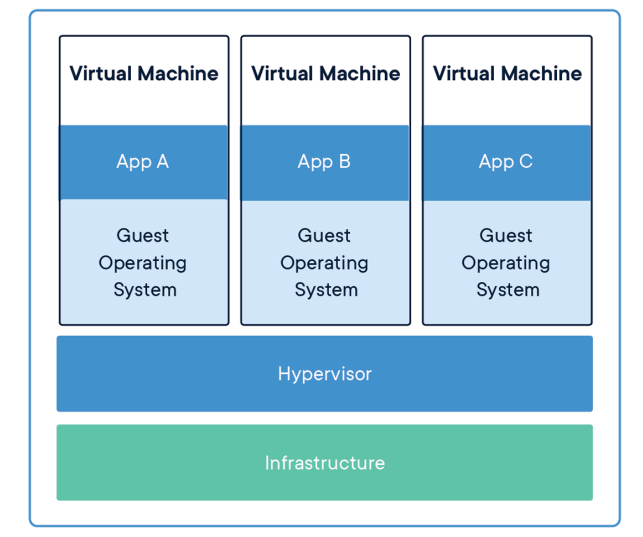

## 📓 키워드

- 가상머신

---

## ✏️ 가상머신

- 전통적 배포방식
  - 컴퓨터 한대에 하나의 OS를 깔고 여러가지 프로그램을 설치하는 방식
  - 계정을 나눠 여러명의 사용자가 이용할 수 있도록 할 수 있지만, 어떤 프로그램을 설치했을때 다른 앱에 영향을 미침
- 가상화 배포방식
  - 가상머신을 기반으로 배포하는 것(컴퓨터의 하드웨어를 소프트웨어적으로 구현한 것)
  - 한대의 컴퓨터를 가지고 여러개의 OS를 구동할 수 있게 되며 CPU, RAM을 물리적으로 바꾸는 것이 아니라 설정만으로 이를 수행 할 수 있음

- 클라우드는 이러한 가상화라는 기술 때문에 1대의 하드웨어로 여러명의 사용자들에게 독립적으로 클라우드 서비스를 할 수 있음
- 단점 : OS가 공유가 안되기 때문에 가상머신에 일일히 OS를 설치해야 함