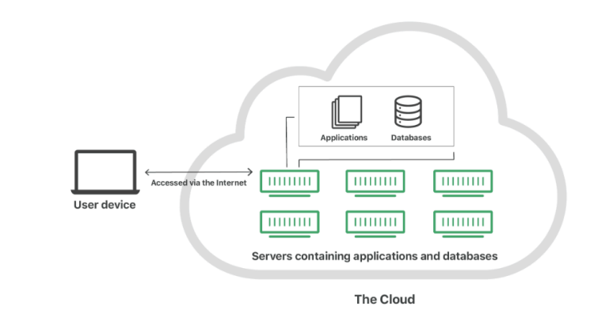

## 📓 키워드

- 클라우드
- 오프프레미스
- 온프레미스

---

## ✏️ 클라우드

- 클라우드 서비스는 내가 아닌 다른 회사의 공급자가 호스팅하고 인터넷을 통해 사용자에게 제공되는 인프라, 플랫폼 또는 소프트웨어를 말함
- 자체 인프라나 하드웨어 설치 없이도 애플리케이션과 리소스에 쉽고 싸게 이용이 가능
- 서버를 직접 구매할 때 고려해야 할 전력, 위치, 서버세팅, 확장성을 고민하지 않고 서비스 운영에만 집중할 수 있음
- `오프프레미스 방식`이라고 함

## ✏️ 온프레미스

- 기업이나 개인이 자체시설에서 보유하고 직접 유지관리하는 프라이빗 데이터 센터를 의미함
- ex) 네이버의 데이터센터 '각'

---

