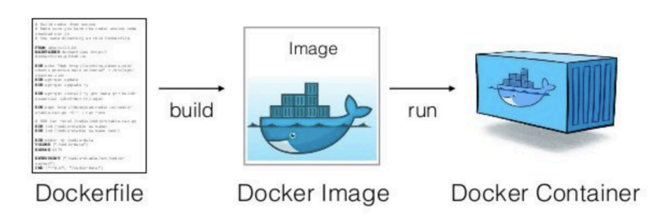

## 📓 키워드

- 컨테이너
- 도커

---

## ✏️ 컨테이너

- 애플리케이션이 한 컴퓨팅 환경에서 다른 컴퓨팅 환경에서 다른 컴퓨팅 환경으로 빠르고 안정적이게 실행되도록 코드와 모든 종속성을 패키징하는 소프트웨어의 표준단위
- 컨테이너는 OS를 공유하기 때문에 경량화되어 있으며 격리성도 휼륭함
- 그러나, OS에 문제가 생기면 다른 앱에도 영향을 미침

## ✏️ 도커

- 컨테이너에 필요한 기능을 모두 제공하는 플랫폼
- 애플리케이션 구동에 필요한 환경설정 관련 절차를 도커파일에 작성하고 그 후 빌드하면 도커이미지가 생성되고 도커이미지를 실행시키면 도커컨테이너가 만들어짐
- 그 후, 도커컨테이너에 설정된 프로그램, 데이터 등이 실제 컴퓨팅자원 위에서 돌아가게 됨

### 💭 도커 생성과정

1. 도커 파일
    - 패키지, 환경변수 등을 기록한 파일
    - 이를 빌드해 도커이미지로 변환
2. 도커 이미지
    - 컨테이너 실행에 필요한 파일과 설정값, 데이터 등을 포함된 상태값이며 불변함
    - 하나의 이미지에서 여러개의 컨테이너를 생성할 수 있음
    - 컨테이너의 상태와는 무관하게 이미지는 그대로 존재함
3. 도커 컨테이너
    - 컨테이너가 실행시키면 도커이미지에 설정된 프로그램, 데이터 등이 실제 컴퓨팅자원과 연결됨