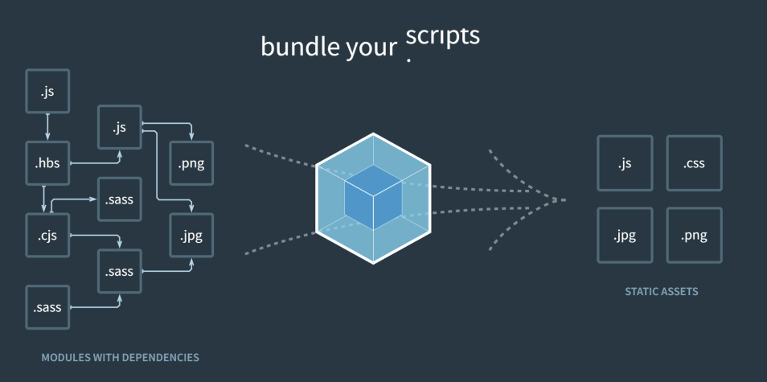

## 📓 키워드

- CI / CD

---

## ✏️ CI / CD

- Continuous Integration(지속적 통합)
- Continuous Delivery / Deployment(지속적 배포)
- 혼자가 아닌 수많은 개발자가 코드를 합치고 배포를 계속해서 시스템 없이 수동으로 한다면 에러가 발생하게 됨
- 이를 해결하기 위해 CI/CD라는 개념이 도래했고 이를 쉽게해주는 툴 등이 나오게 됨

### 💭 파이프라인

- 코드 구축부터 시작해서 배포까지의 일련의 과정들을 `CI/CD 파이프라인`이라고 함
- Continuous Integration : 코드를 빌드하고 테스트하고 합침
- Continuous Delivery : 해당 레퍼지토리에 릴리즈
- Continuous Deployment : 실제 서비스에 배포
- 파이프라인이 주는 장점은 코드배포까지 좀 더 체계적으로 만들고 테스트가 강제됨

#### ☑️ 빌드

- Webpack

#### ☑️ 테스트

- 함수 등 작은 단위를 테스팅하는 `단위테스트`
- 모듈을 통합할 때 테스트하는 `통합테스트`
- 사용자가 서비스를 사용하는 상황을 가정해서 테스트하는 `엔드투엔드테스트`
- mocha.js

#### ☑️ 머지

- git, svn
- 충돌이라는 것은 대부분 발생하기 때문에, 조금 더 작은 단위로 충돌이 일어나게 하는것이 중요함
- 한달동안 코드를 짜서 한번에 배포하는 것이 아닌 작은 이슈단위로 머지

#### ☑️ 배포

- 배포는 사용자를 위한 서비스를 배포하는 것과 더불어 QA엔지니어나 관리자페이지를 위한 배포, 데이터웨어하우스로부터 데이터를 가공해서 백엔드개발자를 위한 배포 등을 포함함

#### ☑️ 대표적인 툴

- Github Action
- Genkins
- Circle CI
- Heroku