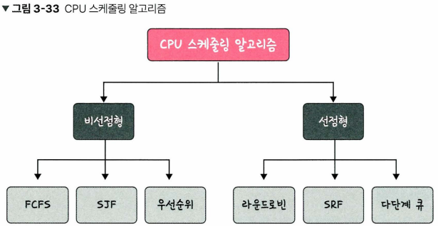
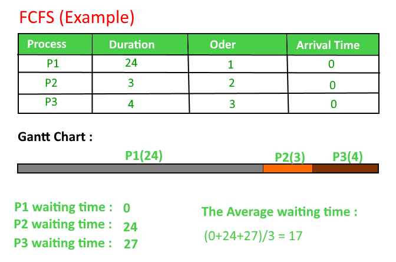
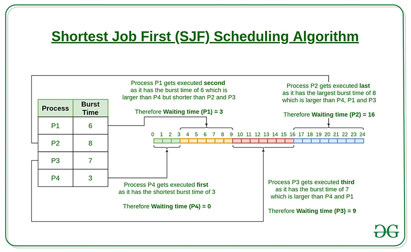
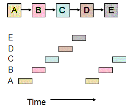
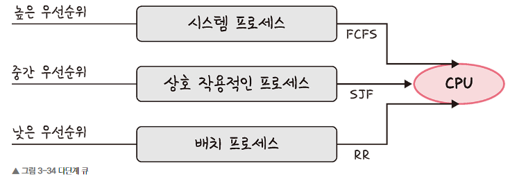

## ✏️ CPU 스케줄링 알고리즘

---
- CPU가 어떤 프로세스를 선택할 것인지를 스케줄링 알고리즘을 토대로 결정
> 1. CPU 사용량이 높은가?
> 2. 처리량이 높은가?
> 3. 대기하는 시간은 짧은가?
 

---

### 💭 비선점형 알고리즘(Non-Preemptive)

- 프로세스가 스스로 CPU 소유권을 포기하는 방식
- 강제로 프로세스를 중지시키지 않는다
- 컨텍스트 스위칭으로 인한 부하가 적다

#### ☑️ FCFS(First Come, First Serve)

- 가장 먼저 온 것을 가장 먼저 처리하는 알고리즘
- 길게 수행되는 프로세스 때문에 준비큐에서 오래 기다리는 현상인 `Convoy Effect`가 발생하는 단점

#### ☑️ SJF(Shortest Job First)

- 실행시간이 가장 짧은 프로세스를 먼저 실행하는 알고리즘
- 긴 시간을 가진 프로세스가 실행되지 않는 현상인 `Starvation`이 일어날 수 있음
- 평균대기시간이 가장 짧음
- 하지만, 실제로는 실행시간을 알 수 없기 때문에, 과거의 실행시간을 토대로 추측해서 사용

#### ☑️ 우선순위

- SJF의 단점인 긴 시간을 가진 프로세스는 실행되지 않는 현상을 보완한 알고리즘
- 오래된 작업일수록 우선순위를 높이는 방법 `Aging`을 통해 보완
- 우선순위는 작업의 시간, 프로세스의 메모리 요구사항, 열린 파일수, 평균 CPU 사용량 등을 통해 결정됨

---

### 💭 선점형 알고리즘(Preemptive)

- 현대 운영체제가 쓰는 방식
- 지금 사용하고 있는 프로세스를 중단시키고 강제로 다른 프로세스에 CPU 소유권을 할당하는 방식

#### ☑️ 라운드 로빈(RR)

- 현대 컴퓨터가 쓰는 스케줄링 방법
- 각 프로세스에 동일한 할당시간을 주고 그 시간안에 끝나지 않으면 다시 준비큐의 뒤로가는 알고리즘
- 할당시간이 너무 크면, FCFS가 됨
- 할당시간이 너무 작으면, 컨텍스트 스위칭이 잦아져서 오버헤드가 많아짐(비용이 커짐)
- 전체 작업시간은 길어지지만, 평균 대기시간(응답시간)은 짧음
- 로드밸런서의 트래픽 분산 알고리즘으로도 사용

#### ☑️ SRF(Shortest Remaining Time First)
- 중간에 더 짧은 작업이 들어오면 수행하던 프로세스를 중지하고, 해당 프로세스를 수행

#### ☑️ 다단계 큐

- 우선순위에 따른 준비 큐를 여러개 사용하고, 큐마다 다른 스케줄링 알고리즘을 사용하는 것
- 큐간의 프로세스 이동이 안되므로 스케줄링 부담이 적지만 유연성이 떨어짐
- 우선순위가 높은 큐부터 처리되기 때문에, 낮은 큐의 프로세스가 처리안되는 `기아현상(starvation)`이 발생할 수 있음
