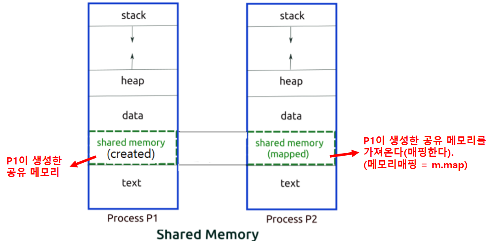
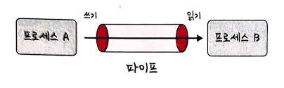
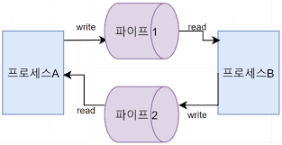
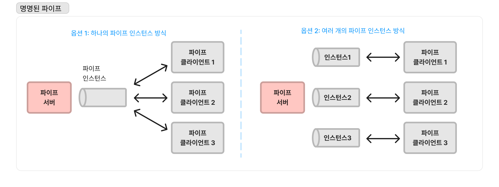
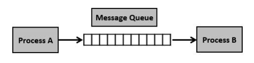

## ✏️ IPC

---

- Inter Process Communication
- 프로세스끼리 데이터를 주고받고 공유데이터를 관리하는 메커니즘
    - IPC의 종류 : 공유 메모리, 파일, 소켓, 파이프, 메시지 큐

### 💭 공유메모리

- 어떤 프로세스가 서로 통신할 수 있도록 메모리를 공유하는 것
- 어떠한 매개체를 통해 데이터를 주고 받는게 아니라 `메모리 자체를 공유`하기 때문에 불필요한 데이터 복사의 오버헤드가 발생하지 않아 `가장 빠르다`
- 같은 메모리 영역을 여러 프로세스가 공유하기 때문에 동기화가 필요함

### 💭 파일

- 디스크에 저장된 데이터를 기반으로 통신하는 것

### 💭 소켓

- 네트워크 인터페이스(HTTP, TCP, UDP)를 기반으로 통신하는 것

### 💭 파이프

#### ☑️ 익명 파이프

- 프로세스 사이에 FIFO 기반의 통신채널을 만들어 통신하는 것
- 파이프 하나당 단방향 통신(반이중 통신)이기 때문에, 양방향 통신을 하려면 2개의 익명파이프를 만들어야 한다
- `부모 / 자식 프로세스 간`에만 사용가능
- 파이프의 데이터 용량은 제한되어 있으며, 쓰기 프로세스가 읽기 프로세스보다 더 빠르게 데이터를 쓸 수 없다

#### ☑️ 명명 파이프

- 익명파이프의 확장된 개념으로, 부모 / 자식 뿐만아니라 `다른 네트워크 상에서도 통신이 가능`한 파이프
- 보통 서버 / 클라이언트용 파이프를 구분해서 동작함

### 💭 메시지 큐

- 큐 자료구조 형태로 관리하는 `메모리공간인 버퍼`를 만들어 통신
1. 프로세스가 메시지를 보내거나 받기전에 큐를 초기화
2. 보내는 프로세스의 메시지는 큐에 복사되어 받는 프로세스에 전달됨