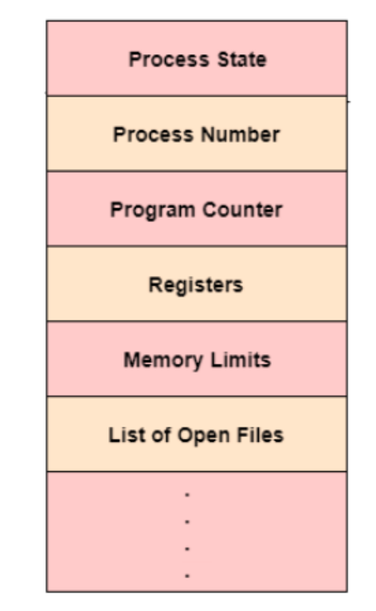
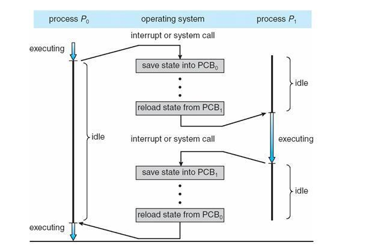

## 📓 키워드

- PCB
- 컨텍스트 스위칭

---

## ✏️ PCB(Process Control Block)

---

- 운영체제에서 관리하는 `프로세스에 대한 메타데이터를 저장`한 데이터 블록
- 커널스택에 저장됨
- 각 프로세스가 생성될 때마다 고유의 PCB가 생성되며, 프로세스가 종료되면 PCB는 제거됨

#### ☑️ 커널스택

- 가상메모리는 사용자공간과 커널공간으로 구분되며 스택을 기반으로 관리되어 사용자스택, 커널스택으로도 불림
- 가상메모리의 가장 처음 시작하는 주소값
- 커널모드에서만 접근가능

#### ☑️ 메타데이터

- 데이터에 관한 데이터이자 데이터를 설명하는 작은데이터
- 대량의 정보 가운데에서 찾고 있는 정보를 효율적으로 찾아내서 이용하기 위해 일정한 규칙에 따라 콘텐츠에 부여되는 데이터

### 💭 PCB의 구조

- 프로세스 상태 : 대기 / 실행중 등 프로세스의 상태
- 프로세스 번호(PID) : 각 프로세스의 고유 식별번호
- 프로그램 카운터(PC) : 이 프로세스에 대한 다음 명령의 주소에 대한 포인터
- 레지스터 : 레지스터 관련정보
- 메모리 제한 : 프로세스의 메모리 관련정보
- 열려있는 파일 목록 : 프로세스를 위해 열린 파일 목록들

---

## ✏️ 컨텍스트 스위칭

- PCB를 기반으로 프로세스의 상태를 저장하고 다시 복원시키는 과정
- CPU에 실행할 `프로세스를 교체하는 기술`
- 프로세스가 종료되거나 인터럽트에 의해 발생

### 💭 컨텍스트 스위칭의 비용

- `유휴시간(idle)의 발생` : 컨텍스트 스위칭을 할때마다 유휴시간이 생겨 CPU의 가용성이 떨어지는 비용이 발생
- `캐시미스` : 프로세스가 가지고 있는 메모리 주소가 그대로 있으면 잘못된 주소 변환이 생기므로 캐시클리어 과정이 일어나게되고 캐시미스가 발생
> 페이지 테이블을 기반으로 실제주소와 가상의 주소를 매핑시키는데 TLB 캐싱계층을 활용하여 비용을 줄일 수 있었다.
> 그러나, 컨텍스트 스위칭이 일어나면 TLB 캐싱계층이 계속 바뀌게 되므로 캐싱계층이 동작하지 않고, 페이지테이블을 직접적으로 참조를 해야하므로 비용이 더 많이 발생

#### ☑️ 스레드에서의 컨텍스트 스위칭

- 스레드는 스택영역을 제외한 모든 메모리를 공유하므로 비용이 더 적고, 시간도 더 적게 걸리는 장점이 존재함