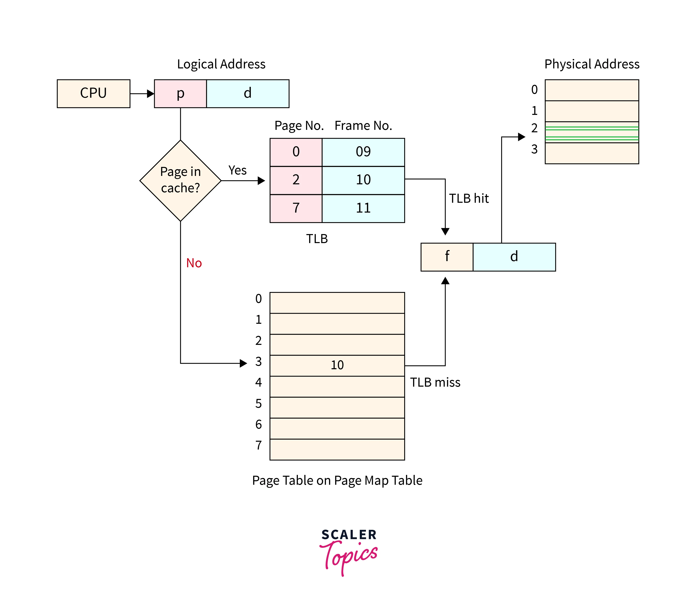
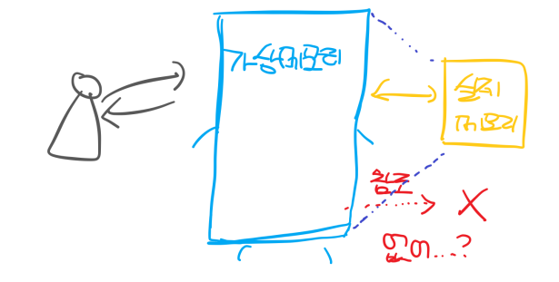
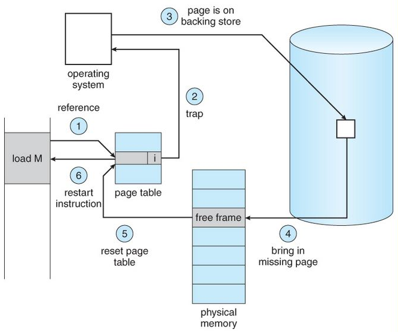
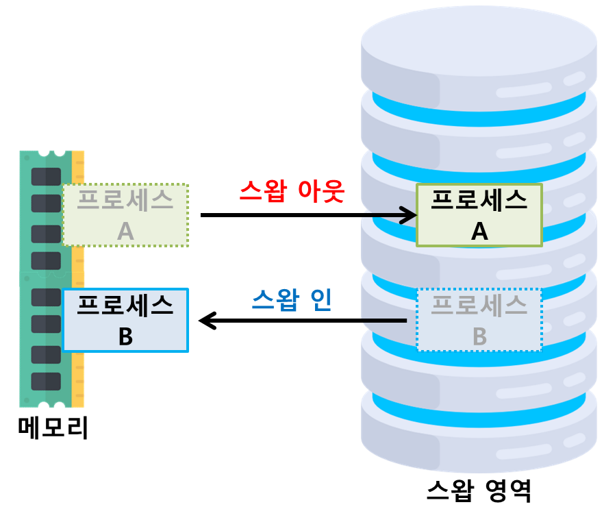
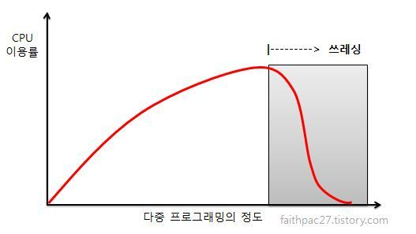
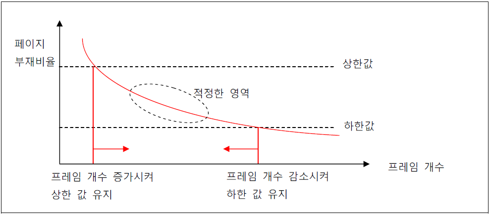

## 📓 키워드

- 가상 메모리
- 페이지 테이블
- 페이지 폴트
- 스레싱

---

## ✏️ 가상 메모리

---

- OS에서 사용되는 메모리 관리기법중 하나
- 컴퓨터가 실제로 이용가능한 메모리 자원(실제 주소)을 추상화하여 이를 사용하는 사용자들에게 매우 큰 메모리로 보이게 만드는 것
- 가상 주소는 MMU와 페이지테이블에 의해 실제주소로 변환됨

#### ☑️ 페이지

- 가상 메모리를 사용하는 최소 크기 단위

#### ☑️ 프레임

- 실제 디스크나 메모리를 사용하는 최소 크기 단위

### 💭 페이지 테이블

- 가상메모리는 가상주소와 실제주소가 매핑되어 있는 페이지테이블로 관리되며 속도향상을 위해 캐싱계층인 TLB를 사용
- 가상주소에서 바로 페이지테이블로 가는 것이 아니라, `TLB에서 있는지를 확인`하고 없으면 페이지테이블로 가서 실제주소를 가져옴

### 💭 페이지 폴트

- 가상메모리에는 존재하지만 실제 메모리인 RAM에는 현재 없는 데이터나 코드에 접근할 경우 발생
- 페이지 폴트의 결과 `스와핑`이 발생

### 💭 페이지 폴트의 과정

1. 어떤 명령어가 유효한 가상주소에 접근했으나 해당 페이지가 없다면 트랩이 발생되어 운영체제에 알림
2. 운영체제는 실제 디스크로부터 사용하지 않은 프레임을 찾음
3. 해당 프레임을 실제 메모리에 가져와서 페이지교체알고리즘을 기반으로 특정페이지와 교체(`스와핑 발생`)
4. 페이지테이블을 갱신시킨 후 해당 명령어를 다시 시작

#### ☑️ 스와핑

- 메모리에 당장 사용하지 않는 영역을 하드디스크로 옮기고, 하드디스크의 일부분을 `마치 메모리처럼` 불러와 사용하는 것

---

### 💭 스레싱

- 메모리의 페이지 폴트율이 높은것
- 메모리에 너무 많은 프로세스가 동시에 올라가게 되어 스와핑이 많이 일어나서 발생
- 페이지폴트가 일어나면 CPU 이용률은 낮아지고, 운영체제는 가용성을 높이기 위해 더 많은 프로세스를 메모리에 올리게되는 악순환이 반복되어 스레싱이 발생
- 이를 해결하기 위해, HDD를 SSD로 바꾸거나, 워킹셋, PFF를 사용

#### ☑️ 워킹셋(Working Set)

- 프로세스의 과거 사용이력을 기반으로 많이 사용하는 페이지 집합을 만들어 미리 메모리에 로드하는 것

#### ☑️ PFF

- Page Fault Frequency
- 페이지 폴트의 빈도를 조절하는 방법
- 상한선에 도달하면 프레임을 늘리고, 하한선에 도달하면 프레임을 줄임

#### ☑️ 가상메모리의 필요성

- `주기억장치의 효율적 관리(스와핑)` : 하드디스크를 주기억장치에 대한 캐시로 설정
- `메모리 관리의 단순화` : 각 프로세스마다 가상메모리의 통일된 주소공간을 배정할 수 있음
- `메모리 용량 및 안정성 보장` : 무한한 가상메모리의 공간을 배정함으로써 프로세스들끼리 메모리 침범이 일어날 확률이 줄어듬