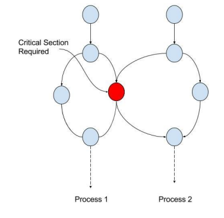
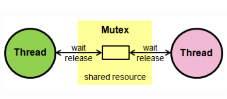
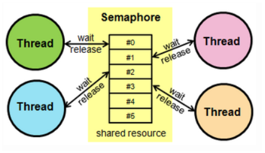

## 📓 키워드

- 공유자원
- 경쟁상태
- 임계영역
- 뮤텍스
- 세마포어
- 모니터

---

## ✏️ 공유자원, 경쟁상태, 임계영역

---

### 💭 공유자원(Shared Resources)

- 시스템 안에서 각 프로세스, 스레드가 함께 접근할 수 있는 자원이나 변수

### 💭 경쟁상태(Race Condition)

- 공유자원을 둘 이상의 프로세스 또는 스레드가 동시에 읽거나 쓰는 상황
- 공유자원에 동시에 접근을 시도할 때의 타이밍이 예상되는 결과값에 영향을 줄 수 있는 형태

### 💭 임계영역(Critical Section)

- 둘 이상의 프로세스 또는 스레드가 공유자원에 접근할 때 순서 등의 이유로 결과가 달라지는 `코드영역`
- 임계영역은 한번에 둘 이상의 프로세스나 스레드가 들어갈 수 없게 설계됨
- 경쟁상태가 발생할 수 있는 코드부분

#### ☑️ 경쟁상태 관리의 중요성

- 데이터의 정합성, 무결성을 지키지 못할 수 있음

> 데이터의 정합성 : 예상되는 데이터의 값과 다른 것 
> 데이터 무결성 : 데이터의 어떠한 규칙을 위반하면 안되는 것

---

## ✏️ 경쟁상태를 해결하는 방법

---

- `뮤텍스, 세마포어, 모니터`는 경쟁상태를 해결하는 대표적인 방법
- 이들은 `상호배제, 한정대기, 진행` 조건을 만족하면서 경쟁상태를 해결함

#### ☑️ 상호배제(Mutual Exclusion)

- 한 프로세스가 임계영역에 들어갔을 때 다른 프로세스는 진입할 수 없음

#### ☑️ 한정대기(Bounded Waiting)

- 임계영역에 진입하는 횟수에 제한을 두어 특정프로세스가 영원히 임계영역에 머무는것을 방지
- 기다리면 언젠가는 임계구역에 진입할 수 있어야 함(starvation free)

#### ☑️ 진행(Progress)

- 어떠한 프로세스도 임계영역을 사용하지 않는다면 임계영역의 외부의 어떠한 프로세스도 들어갈 수 있으며, 이때 프로세스끼리 서로 방해하지 않는 것
- 임계구역이 비었으면 사용할 수 있어야 함(deadlock free)

### 💭 뮤텍스(Mutex)

- 공유자원을 `lock()`을 통해 잠금설정하고 사용한후에 `unlock()`을 통해 잠금해제가 되는 `객체 lock`을 기반으로 경쟁상태를 해결
- 잠금이 설정되면 다른 프로세스나 스레드는 임계영역에 접근 불가
- 한번에 하나의 프로세스만 임계영역에 존재

### 💭 세마포어(Semaphore)

- 일반화된 뮤텍스
- 정수 `S`와 `wait()` `signal()`로 공유자원에 대한 접근
- 여러 프로세스가 동시에 임계영역 접근가능
- `S`는 현재 쓸수 있는 공유자원의 수
- `wait()`는 S를 1씩 감소시키며, 프로세스가 임계영역에 들어간 상태, P( )라고도 함
- `signal()`는 S를 1씩 증가시키며, 공유자원을 프로세스가 다 쓴 상태, V( )라고도 함

#### ☑️ 뮤텍스와 세마포어의 차이점

- `뮤텍스`는 잠금을 기반으로 상호배제가 일어나는 `잠금 메커니즘`, 프로세스 1개
- `세마포어`는 신호를 기반으로 상호배제가 일어나는 `신호 메커니즘`, 프로세스 여러개

### 💭 모니터

- 둘 이상의 스레드나 프로세스가 공유자원에 안전하게 접근할 수 있도록 공유자원을 숨기고, 해당 접근에 대해 `인터페이스를 제공`하는 객체
- 공유자원에 대한 작업들을 순차적으로 처리함(큐)

#### ☑️ 모니터와 세마포어의 차이점
- `모니터`는 구현하기 쉬우며, `한번에 하나의 프로세스`만 공유자원에 접근가능(상호배제 충족)하며 `인터페이스`를 기반으로 구축됨
- `세마포어`는 구현하기 어려우며, `한번에 여러개의 프로세스`가 공유자원에 접근가능하며 `상호배제`를 명시적으로 구현해야 함. `정수변수(S)`를 기반으로 구축됨