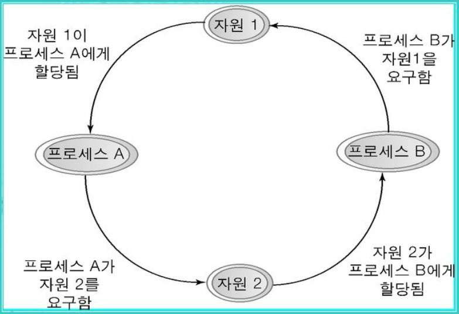
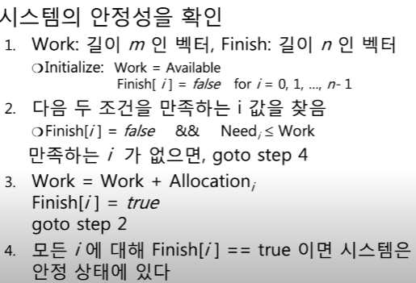
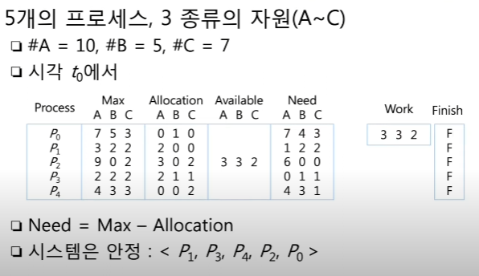
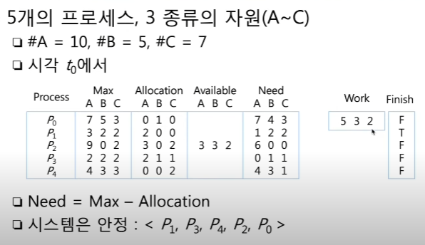
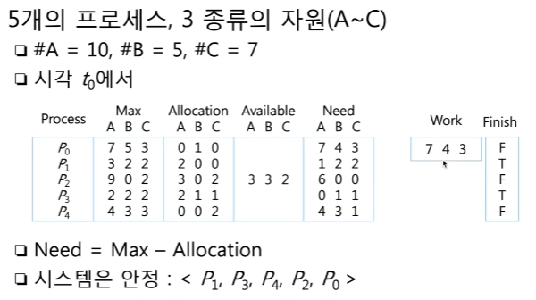
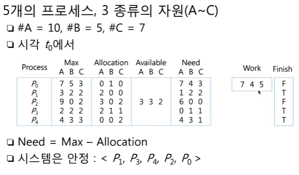
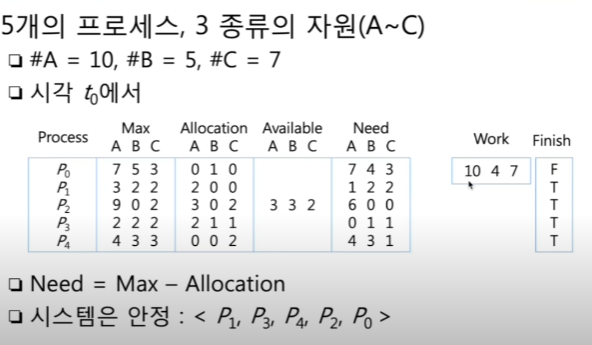
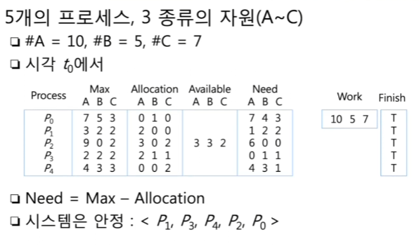
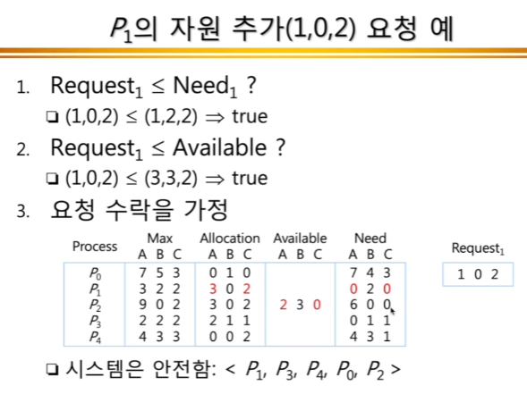
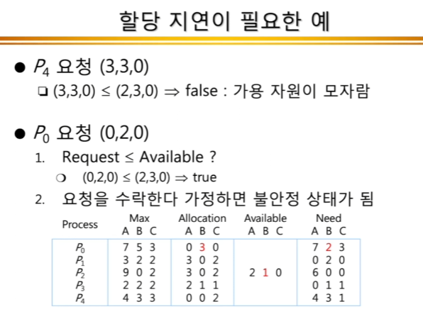

## ✏️ 교착상태(Deadlock)

---

- 두 개 이상의 프로세스들이 서로가 가진 자원을 기다리며 중단된 상태
- 각 프로세스는 서로가 원하는 자원을 유지한 채 다른 프로세스의 자원을 얻기를 기다리는 것

### 💭 교착상태의 필요조건

- `상호배제`
    - 주어진 시간내에 하나의 프로세스만 자원을 독점할 수 있음
    - 다른 프로세스들은 접근 불가
- `점유대기`
    - 특정 프로세스가 점유한 자원을 다른 프로세스가 요청하며 대기하는 상태
- `비선점`
    - 다른 프로세스의 자원을 강제적으로 가져올 수 없음 
- `환형대기`
    - 서로가 서로의 자원을 요구하는 상황

4가지 조건이 모두 충족되어야 `교착상태가 일어날 수 있음`. 모두 충족되더라도 꼭 교착상태가 발생하진 않음

### 💭 교착상태의 해결방법

- 자원을 할당할 때 애초에 조건이 성립되지 않도록 설계
- `은행원 알고리즘` 사용
- 교착상태가 발생하면 사이클이 있는지 찾아보고, 이에 관련된 프로세스를 한개씩 지움
- 교착상태는 매우 드물게 일어나므로 이를 처리하는 비용이 더 커서 교착상태가 발생하면 사용자가 작업을 종료함
    - ex) 응답없음
  
  

---

### 💭 은행원 알고리즘
- 교착상태를 회피하는 알고리즘
- 총 자원의 양과 현재 할당한 자원의 양을 기준으로 안정 또는 불안정 상태로 나누고 안정상태로 가도록 자원을 할당하는 알고리즘

> 안정상태 : 교착상태를 일으키지 않는 상태이며, 프로세스의 최대자원요구량을 운영체제가 충족시킬 수 있는 상태

> 불안정상태 : 안전상태로 가는 순서열이 존재하지 않는 상태

#### ☑️ 은행원 알고리즘의 구조
- `available[i]` : 운영체제가 프로세스에게 자원을 줄 수 있는 양
- `max[i][j]` : 프로세스가 필요로하는 자원의 최대요구량
- `allocation[i][j]` : 프로세스에 현재 할당되어있는 자원양
- `need[i][j]` : 프로세스의 자원 추가요구량
- `finish[i]` : i번째 프로세스가 요청하는 양을 운영체제가 만족할 수 있는지를 파악하는 배열

#### ☑️ 안정성 알고리즘

#### ☑️ 자원요청 알고리즘

#### ☑️ 은행원 알고리즘 순서
#### 초기상태

#### P1 완료

#### P3 완료

#### P4 완료

#### P2 완료(P0를 먼저 해줘도 됨)

#### P0 완료

#### ☑️ 자원 추가요청 예시

#### ☑️ 은행원 알고리즘의 단점
- 프로세스가 시스템에 들어갈 때 필요한 최대 자원 수를 예측해야 하는데, 이를 예측하기가 어려움
- 자원소모량이 증가하게 되며 프로그램의 수는 고정되어있지 않고 변하기 때문에 사용하기 어려움