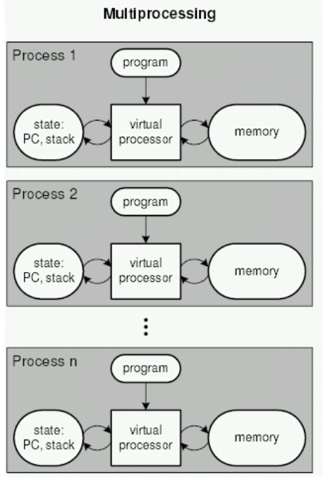
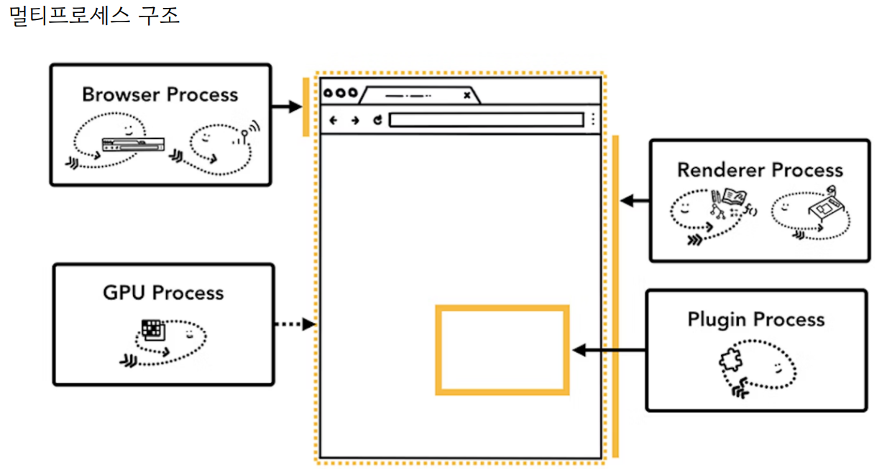
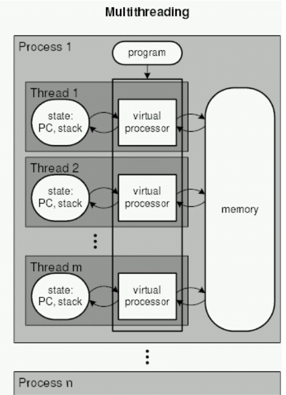
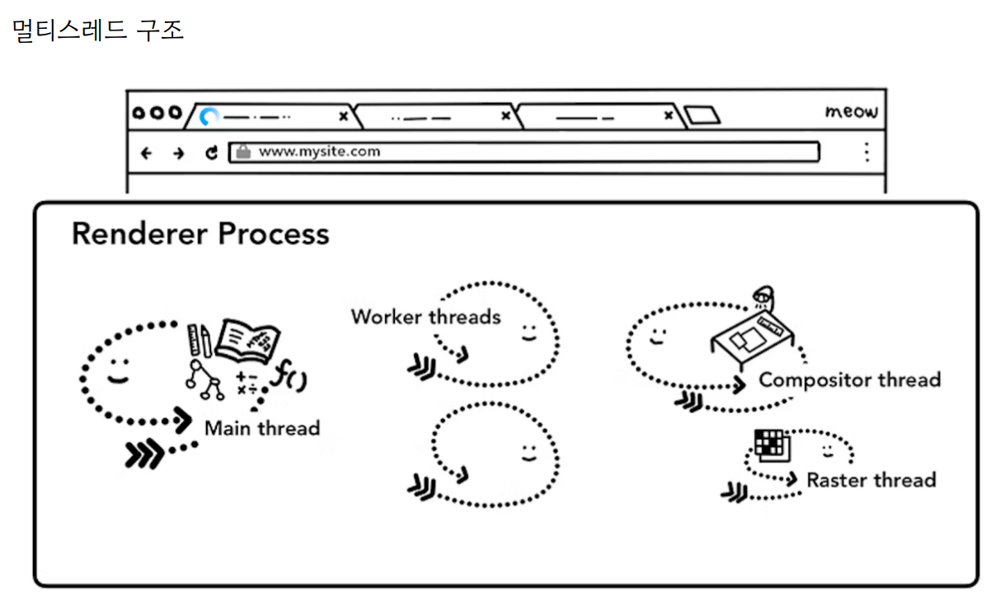

## ✏️ 멀티 프로세싱

---

- 여러개의 프로세스
- 두 가지 이상의 일을 수행할 수 있는 것
- 특정 프로세스에 문제가 발생되더라도 다른 프로세스에 영향을 미치지 않으며 격리성과 신뢰성이 높은 장점
- 여러개의 프로세스를 만든 상태를 멀티프로세스라고하며 이를 기반으로 작업 하는 것을 멀티프로세싱이라고 함

---

## ✏️ 멀티 스레딩

---

- 프로세스 내 작업을 멀티스레드로 처리하는 기법
- 스레드끼리 서로 자원을 공유하고 프로세스보다는 가볍기 때문에 효율성이 높은 강점
- 한 스레드에 문제가 발생되면 다른 스레드에도 영향을 끼쳐 결론적으로 프로세스에 영향을 줄수 있는 단점
- 여러개의 스레드를 만든 상태를 멀티스레드라고 하며 이를 기반으로 작업하는 것을 멀티스레딩이라고 함

