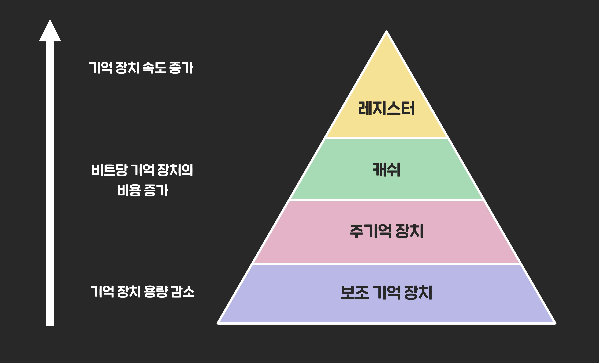

## 📓 키워드

- 메모리 계층

---

## ✏️ 메모리 계층

---

`레지스터 + 캐시 + 주기억장치 + 보조기억장치`

### 💭 레지스터

- CPU내의 작은 메모리
- 휘발성, 속도 가장 빠름
- 기억용량이 가장적음

### 💭 캐시

- CPU내의 L1, L2캐시를 지칭
- 휘발성, 속도 빠름
- 기억용량 적음

### 💭 주기억장치

- RAM
- 휘발성, 속도 보통
- 기억용량 보통

### 💭 보조기억장치

- HDD, SDD
- 비휘발성, 속도 느림
- 기억용량 많음

#### ☑️ 계층이 존재하는 이유
- `더 빠른 접근과 처리속도 증가`
- `비용의 효율성` : 캐시는 비싸고 보조기억장치는 저렴하다
- `자원의 효율적 사용` : 자주접근하는 데이터는 빠른 메모리에, 덜접근하는 데이터는 느린메모리에 저장