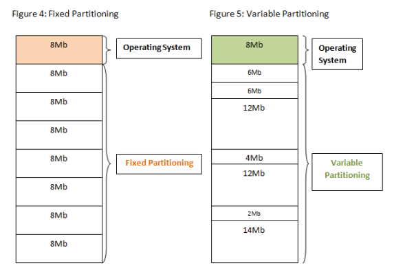
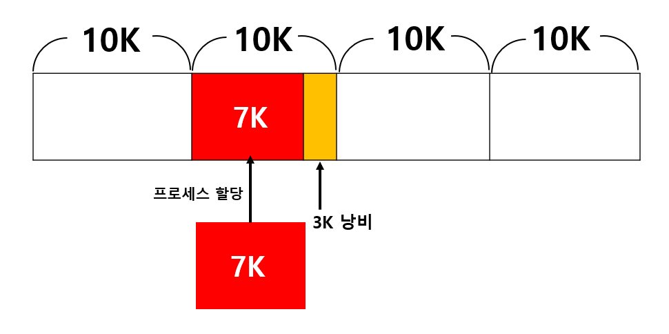
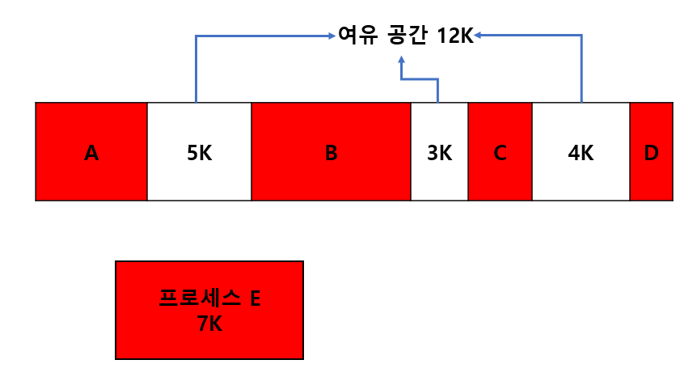
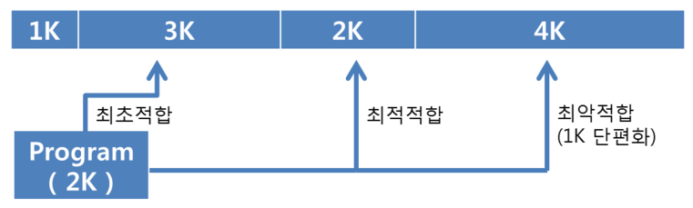
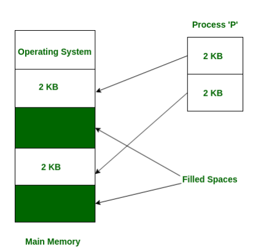
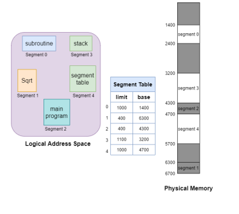

## ✏️ 메모리 할당

---

- 프로그램에 필요한 메모리를 할당할 떄 시작 메모리 위치, 메모리 할당 크기를 기반으로 할당
- 연속할당, 불연속할당으로 나눔

### 💭 연속 할당(Contiguous Memory Allocation)

- 메모리에 연속적으로 공간을 할당하는 것
- 사용가능한 메모리 공간이 같은 위치에 존재(메모리 파티션이 전체 메모리 공간에 분산 x)
- 고정분할방식, 가변분할방식이 존재

#### ☑️ 고정분할방식(Fixed Partition Allocation)

- 메모리를 같은 크기로 분할해서 할당하는 방법
- `내부단편화`가 발생

>`내부단편화` : 프로그램이 필요공간보다 더 많은 메모리가 할당되어, 내부적으로 조각이 많이 생기는 것

#### ☑️ 가변분할방식(Variable Partition Allocation)

- 프로그램에 필요한만큼 동적으로 할당하는 기법
- `외부단편화`가 발생

>`외부단편화` : 동적으로 할당한 외부에 작은 조각들이 생기게 되는 현상

>`최초적합(First Fit)` : 위쪽이나 아래쪽부터 시작해서 홀을 찾으면 바로 할당 
>`최적적합(Best Fit)` : 필요한 메모리 크기 이상인 공간 중 가장 작은 홀부터 할당 
>`최악적합(Worst Fit)` : 프로세스의 크기와 가장 차이가 많은 홀에 할당

#### ☑️ 홀(hole)

- 할당 할 수 있는 비어있는 메모리 공간

---

### 💭 불연속 할당(Non-contiguous Memory Allocation)

- 메모리를 연속적으로 할당하지 않는 현대 운영체제가 쓰는 방법
- 프로그램에 필요한 메모리를 쪼개서 서로 다른 위치에 있는 메모리 공간에 할당
- 페이징, 세그먼테이션, 페이지드세그먼테이션기법이 있음

#### ☑️ 페이징

- 동일한 크기의 페이지 단위로 나누어 메모리의 서로 다른 위치에 프로세스를 할당
- 홀의 크기가 균일해지지만, 주소변환을 페이지별로 해야하기 때문에 복잡해지는 단점이 존재
- `내부단편화` 발생할 수 있음

#### ☑️ 세그먼테이션

- 페이지 단위가 아닌 세그먼트로 나누는 방식
- 공유와 보안 측면에서 좋지만 홀크기가 균일하지 않음
- `외부단편화` 발생할 수 있음

#### ☑️ 페이지드 세그먼테이션

- 세그먼테이션으로 나누되, 해당 세그먼테이션을 동일한 크기의 페이지로 나누는 방법