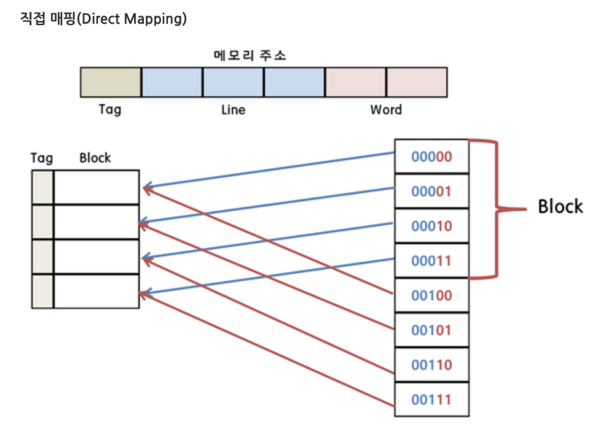

## ✏️ 캐시

---

- 데이터를 미리 복사해 놓는 임시 저장소
- 빠른장치와 느린장치사이에서 발생하는 속도차이에 따른 병목현상을 줄이기 위한 메모리
- 데이터접근시간의 단축, 데이터를 다시계산하는 시간을 절약
    - ex) CPU 레지스터

#### ☑️ 캐시히트

- 캐시에서 원하는 데이터를 찾은 것

#### ☑️ 캐시미스

- 캐시에서 원하는 데이터를 찾지 못한 것
- 메모리로 가서 원하는 데이터를 레지스터에 등록하게 됨

#### ☑️ 캐시계층 예시

1. Redis데이터베이스를 캐시계층으로 둠

2. Nginx서버를 캐시계층으로 둠

#### ☑️ 지역성(Locality)

- 캐시를 설정할 때는 자주 사용하는 데이터를 기반으로 설정
- `시간지역성` : 최근 사용한 데이터에 다시 접근하려는 특성
- `공간지역성` : 최근 접근한 데이터를 이루고 있는 공간이나 그 가까운 공간에 접근하는 특성

---

## ✏️ 매핑

- 캐시의 크기는 메모리보다 항상 작기 때문에 효율적으로 매핑하는 것이 중요함
- 매핑을 `사상`이라고 부르기도 함

### 💭 직접 매핑(Direct Mapping)

- 메모리의 특정 블록은 특정 캐시라인에만 매핑할 수 있는 것
- 직접 블록별 매핑하는 것
- 장점 : 해당 블록만 확인하게 되서 처리가 빠름
- 단점 : 스와핑이 빈번하게 발생할 수 있음

#### ☑️ 내부 구성

- 운영체제는 메모리를 똑같은 크기의 페이지로 나눠서 관리를 함(<P,D>)
- P : 페이지 번호, D : 페이지번호로부터 해당주소까지의 거리
- 가상주소에서 실제주소로 변환될때, D는 변하지 않고 P만 변환됨
- P는 {tag, bd}로 세분화해서 직접매핑을 구현함
- bd가 같은 라인만 매핑이 되게 함

### 💭 연관 매핑(Associative Mapping)

- 자유롭게 연관 매핑을 함
- 순서를 일치시키지 않고 관련있는 캐시와 메모리를 매핑
- 메모리의 컨텐츠가 캐시의 어느 위치에도 올라갈 수 있는 방법
- 장점 : 스와핑이 덜 일어남
- 단점 : 캐시의 모든 블록을 탐색해야해서 느리다

### 💭 집합 연관매핑(Set Associative Mapping)

- 집합을 나누고(직접매핑) 해당집합에는 bd만 같으면 들어올 수 있게 하는데 어떤 블록에도 들어올수 있게 하는 것
- 모든 블록을 찾을 필요없이 특정블록을 찾게해 탐색비용을 낮추고 스와핑을 완화시키는 직접매핑과 연관매핑의 장점을 모두 지님