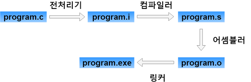

## ✏️ 컴파일 과정

---

컴파일러가 컴파일 과정을 거쳐 컴퓨터가 이해할 수 있는 기계어로 번역되어 실행할 수 있는 파일이 된 것

### 💭 컴파일 과정

#### ☑️ 전처리기

- 소스코드의 주석제거
- 헤더파일 등을 병합 & 소스코드내 삽입
  - #include
- 매크로를 치환
    - #define

#### ☑️ 컴파일러

- 오류처리, 문법검사
- 코드 최적화
- 어셈블리어로 변환

#### ☑️ 어셈블러

- 리눅스에서는 `.o` 확장자를 가짐
- 목적코드(object code)로 변환

#### ☑️ 링커

- `.exe` `.out` 확장자를 가짐
- 프로그램 내에 있는 라이브러리 함수 등과 결합해 실행파일이 만들어짐