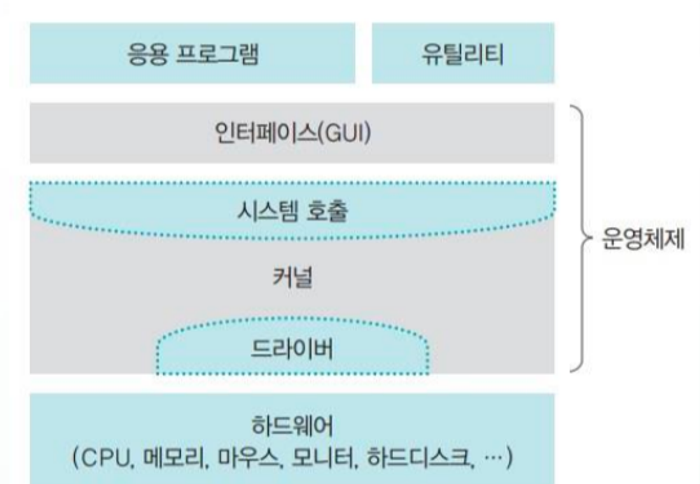
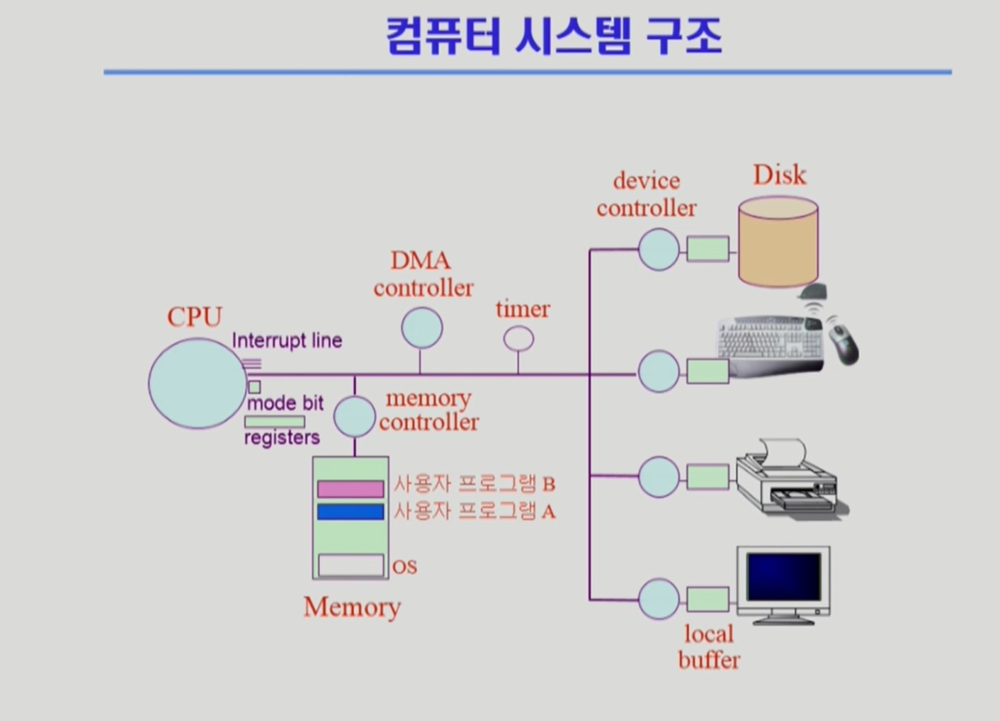
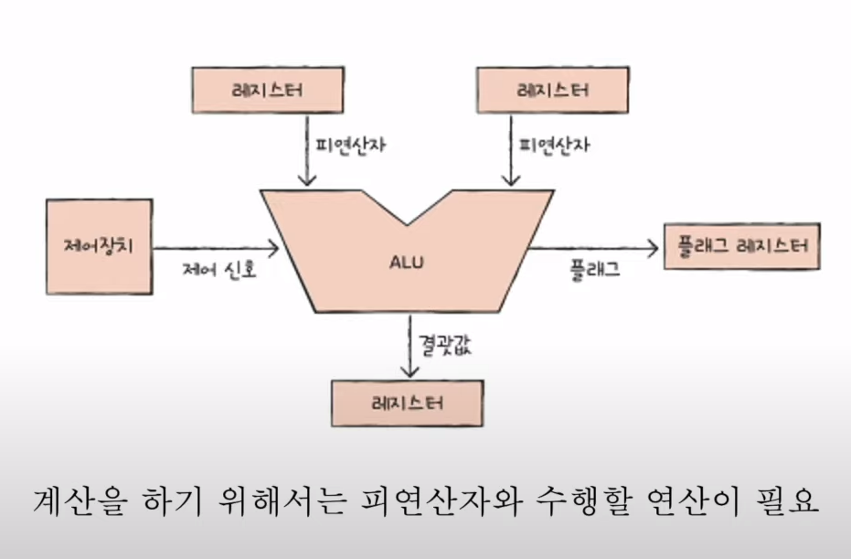
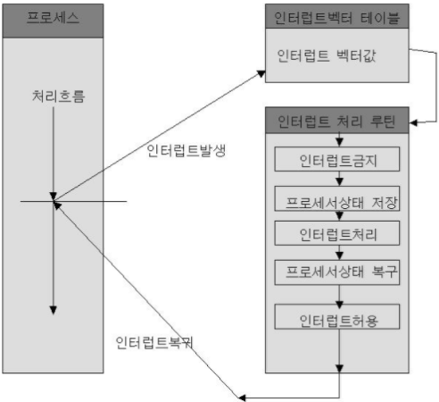
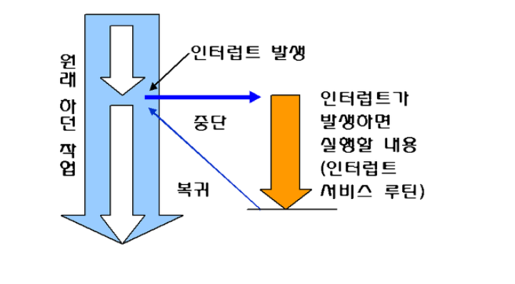
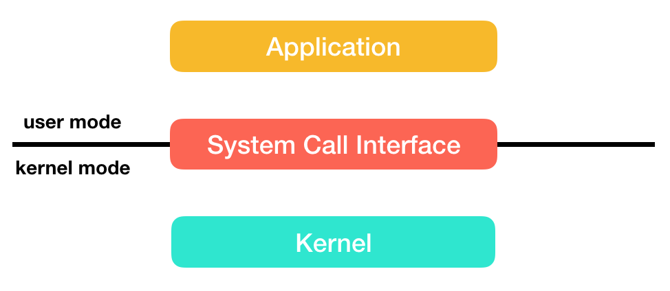
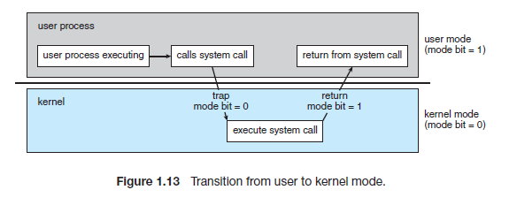

## 📓 키워드

- 운영체제
- CPU
- 인터럽트
- 시스템 콜

---

## ✏️ 운영체제

---

### 💭 운영체제의 종류

- GUI
  - Graphical User Interface
  - 그래픽을 사용하여 컴퓨터와 상호작용하는 인터페이스
    - ex) WindowOS, MacOS
- CUI
  - Character User Interface
  - 키보드만을 사용하여 문자를 기반으로 컴퓨터와 상호작용하는 인터페이스
  - 1994년 단종
    - ex) MS-DOS

### 💭 운영체제의 역할

- 운영체제의 `커널`이 담당
- CPU 스케줄링과 프로세스 상태관리
- 메모리 관리
- 디스크파일 관리
- I/O 디바이스 관리

### 💭 운영체제의 구조

- 운영체제 = `인터페이스(GUI) + 시스템 콜 + 커널`

---

## ✏️ 컴퓨터 시스템의 구조

---

- CPU : 인터럽트에 의해 메모리에 존재하는 명령어를 해석해서 실행하는 일꾼
- DMA 컨트롤러 : CPU의 일을 보조하는 일꾼
- 메모리 : 전자회로에서 데이터, 상태 등을 기록하는 장치(작업장)
- 타이머 : 특정 프로그램에 시간을 다는 역할
- 디바이스 컨트롤러 : I/O 디바이스들의 작은 CPU
- 로컬버퍼 : 디바이스에 달려있는 작은 메모리

### 💭 CPU

- `ALU(산술논리 연산장치) + CU(제어장치) + 레지스터`
- 인터럽트에 의해 메모리에 존재하는 명령어를 해석해서 실행하는 일꾼

#### ☑️ ALU

- Arithmetic and Logical Unit
- 덧셈, 뺄셈, 곱셈, 나눗셈 등 산술연산과 논리연산을 하는 회로장치

#### ☑️ CU

- Control Unit
- 프로세스의 조작을 지시하며 명령어들을 읽고 해석하며 데이터처리를 위한 순서를 결정

#### ☑️ 레지스터

- CPU 안에 있는 매우 빠른 임시기억장치

---

### 💭 인터럽트

- 어떤 신호가 들어왔을 때, CPU를 잠깐 정지시키는 것
  - ex) 0으로 나누는 산술연산 오류, 프로세스 오류 등으로 발생
  - ex) 키보드, 마우스 등 I/O 디바이스를 사용할 때의 인터럽트
  - ex) 우선순위가 높은 프로세스의 발생 등으로도 인터럽트 발생

> CPU는 메모리에 있는 명령어(Instruction)를 순차적으로 실행하는데, 인터럽트가 발생되면 점프해서 인터럽트 핸들러 함수가 모여있는 인터럽트 벡터로 가서 인터럽트핸들러 함수(인터럽트 서비스 루틴, ISR)가 실행되며 특정 명령어를 실행하게 됨. 이후 인터럽트가 종료되면 다시 순차적으로 실행

#### ☑️ 하드웨어 인터럽트

- I/O 디바이스 등 하드웨어에서 발생하는 인터럽트
  - ex) 마우스 클릭, 디스크에서 파일읽기/쓰기 작업

#### ☑️ 소프트웨어 인터럽트

- `트랩`이라고도 함
- 프로세스 오류, 프로세스의 종료, 시작 등을 기반으로 프로세스에서 발생하는 인터럽트
- 하드웨어 인터럽트보다 우선순위가 높은 인터럽트

---

### 💭 시스템 콜

- 운영체제가 `커널에 접근하기 위한 인터페이스`
- 유저 프로그램이 운영체제의 서비스를 받기 위해 `커널함수를 호출`할 때 이를 거쳐서 호출하도록 설계됨
- 프로세스 관리, 파일관리, 디바이스 관리, 날짜 및 시간관련 시스템, 프로세스간 통신 때, 이를 통해 커널함수를 호출
  - ex) kill( ) 함수

### 💭 시스템 콜의 과정

1. 유저 프로그램이 I/O 요청 트랩 발동
2. 올바른 I/O 요청인지 확인
3. 유저모드가 시스템 콜을 통해 커널모드로 변환
4. 커널함수 실행

#### ☑️ 커널함수

- Native Function
- 커널안에 있는 여러개의 함수

#### ☑️ 커널

- 운영체제의 핵심 부분이자 시스템콜을 제공
- 보안, 메모리, 프로세스, 파일시스템, I/O 디바이스, I/O 요청 관리 등 운영체제의 중추적인 역할

#### ☑️ 유저모드

- 유저가 접근할 수 있는 영역
- 제한적이며 컴퓨터 자원에 함부로 침범하지 못하는 모드

#### ☑️ 커널모드

- 모든 컴퓨터 자원에 접근할 수 있는 모드

#### ☑️ mode bit

- 시스템 콜이 작동될 때 `modebit을 기반으로 유저모드와 커널모드를 구분`함
- 플래그 변수(0 or 1)
- 1은 유저모드, 0은 커널모드

### 💭 시스템 콜의 장점

- 유저 프로그램은 시스템콜을 기반으로 커널과 분리됨
- 즉, 유저 프로그램은 복잡한 파일 시스템과 프로세스 생성 등에 대한 내부동작을 신경쓸 필요가 없음
- 운영체제의 관리하에 프로그램이 운영되므로 시스템의 안정성과 보안이 강화됨