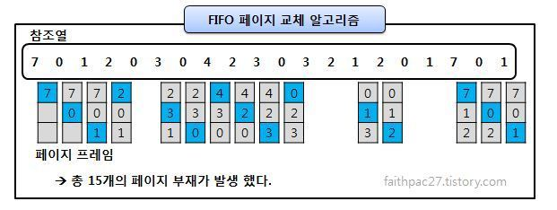
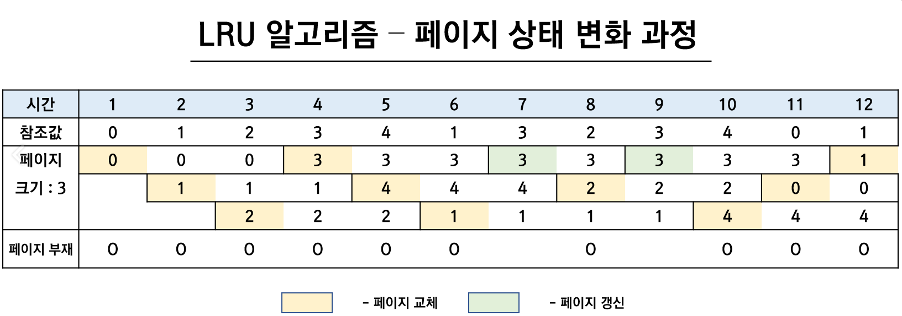
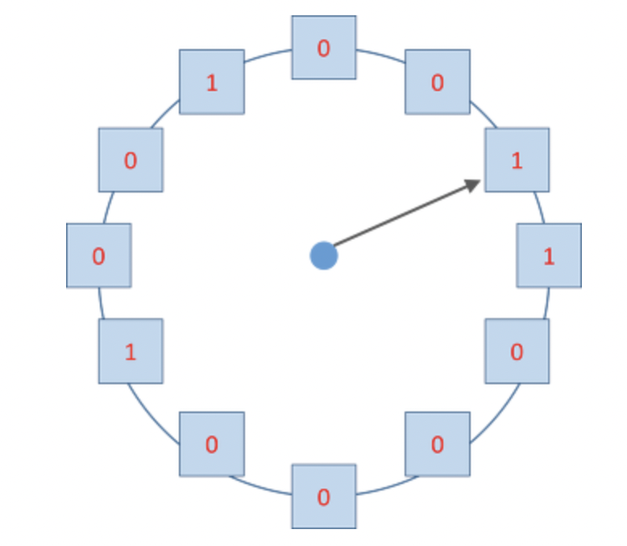
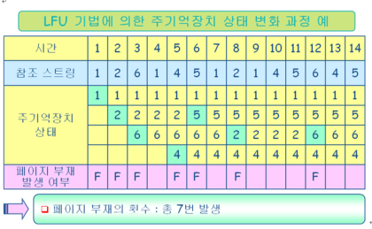

## 📓 키워드

- LFD
- FIFO
- LRU
- NUR
- LFU

---

## ✏️ 페이지 교체 알고리즘

---

- 스와핑이 일어날 때, 페이지교체 알고리즘에 의해 페이지가 교체됨

### 💭 오프라인 알고리즘(LFD)

- Longest Forward Distance
- 가장 좋은 알고리즘
- 가장 먼 미래에 참조되는 페이지와 현재의 페이지를 교체하는 알고리즘
- 그러나, 미래에 사용되는 프로세스를 알지 못해서 사용불가
- 다른 알고리즘과의 성능비교에 대한 상한선을 제공

### 💭 FIFO

- First In First Out
- 가장 먼저 온 페이지부터 교체하는 알고리즘

### 💭 LRU

- Least Recently Used
- 최근에 사용되지 않은 페이지를 교체하는 알고리즘
- 참조가 오래된 페이지를 바꾸는 방법
- 최근 사용한 횟수를 나타내는 자료구조를 따로 만들어야 할 수도 있음

### 💭 NUR

- Not Used Recently
- NRU(Not Recently Used)라고도 불림
- LRU에서 발전한 알고리즘
- Clock알고리즘이라고도 하며 시계방향으로 돌면서 0을 찾는 순간 해당 페이지를 교체하고, 해당부분을 1로 바꾸는 알고리즘
- 1은 최근에 참조됨, 0은 참조되지 않음을 의미
- 만약, 한바퀴를 도는동안 사용되지 않으면 0이됨

### 💭 LFU

- Least Frequently Used
- 참조횟수가 가장 적은 페이지를 교체하는 알고리즘