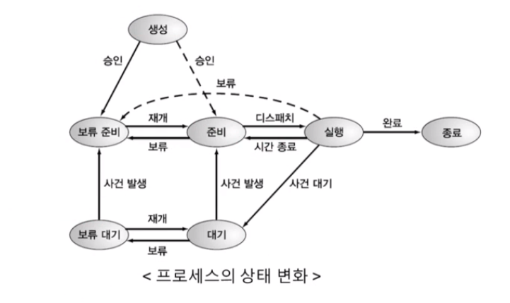

## 📓 키워드

- 프로세스 상태

---

## ✏️ 프로세스 상태

---

`Blocked, Blocked Suspended, Ready Suspended`를 묶어서 `Waiting`으로 표현하기도 함

### 💭 생성(New, Create)

- fork( ), exec( ) 함수를 통해 프로세스가 생성된 상태
- 사용자가 요청한 작업이 커널에 등록되고 PCB가 만들어져 프로세스가 만들어진 상태
- 메모리공간이 충분하면 메모리를 할당하고 준비 상태로 바꿈
- 메모리공간이 없으면 할당하지 않고 보류준비 상태로 바꿈 

#### ☑️ fork( )

- 부모 프로세스의 주소공간을 그대로 복사하며, 새로운 자식 프로세스를 생성하는 함수
- 주소공간만 복사할 뿐, 부모프로세스의 비동기작업 등을 상속하진 않음

#### ☑️ exec( )

- 새롭게 프로세스를 생성하는 함수

### 💭 준비(Ready)

- 처음 프로세스가 생성된 이후, 메모리 공간이 충분하면 메모리를 할당받고 아니면 준비큐에 들어가서 대기중인 상태
- CPU 스케줄러로부터 CPU 소유권이 넘어오기를 기다리는 상태
- CPU를 할당받으면 실행 상태로 바뀜(`Dispatch`)

### 💭 실행(Running)

- CPU 소유권과 메모리를 할당받고 인스트럭션을 수행중인 상태
- `CPU burst`가 일어났다라고도 표현

### 💭 대기(Blocked)

- 어떤 이벤트가 발생한 이후 기다리며 프로세스가 차단된 상태
    - 프린트 I/O 요청

### 💭 보류대기(Blocked Suspended)

- 중단된 상태에서 프로세스가 실행되려 했지만 메모리부족으로 일시 중단된 상태

### 💭 보류준비(Ready Suspended)

- 준비큐가 꽉찬 상태
- 메모리 부족으로 일시 중단된 상태

### 💭 종료(Exit, Terminated)

- 프로세스가 실행이 완료되어 해당 프로세스에 대한 자원을 반납하며 PCB가 삭제되는 상태
- 자연스럽게 종료되는 것도 있지만 부모프로세스가 자식프로세스를 강제적으로 종료시켜 비자발적 종료되기도 함
- 자식프로세스에 할당된 자원의 한계치를 넘어서거나 부모프로세스가 종료되거나 사용자가 process.kill 등 여러 명령어로 프로세스를 종료시킬때 발생