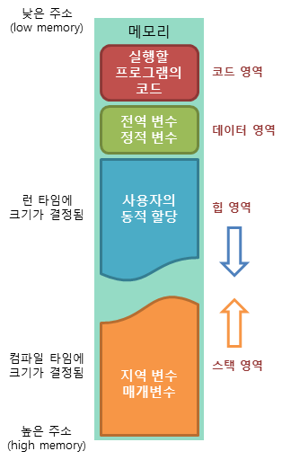
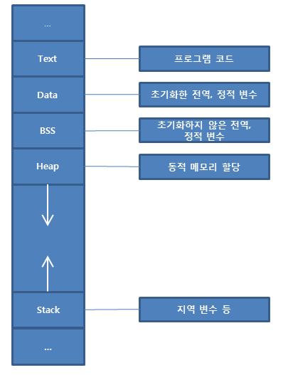
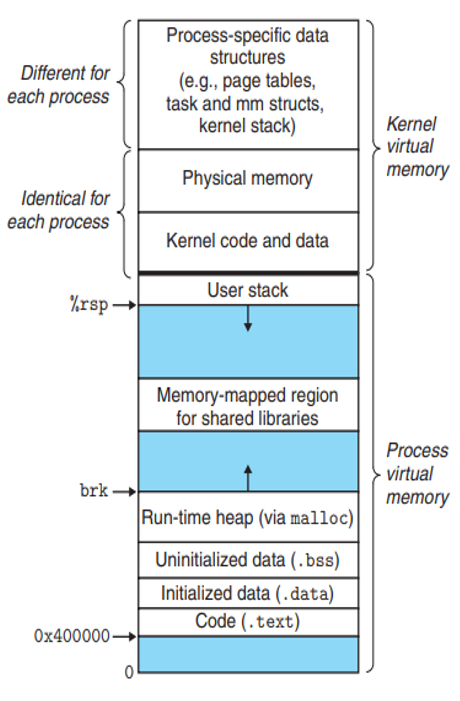

## ✏️ 프로세스의 메모리 구조

---

운영체제는 프로세스에 적절한 메모리를 할당하는데 다음 구조를 기반으로 할당함

### 💭 스택영역

- 지역변수, 매개변수, 리턴값, 함수가 저장됨
- 함수가 호출될 때마다 Stack에 계속해서 저장됨
- 함수의 호출과 함께 할당되며, 함수의 호출이 완료되면 소멸
- 컴파일 시에 크기가 결정됨
- 커널영역을 보호하기 위해 메모리의 높은 주소에서 낮은 주소 방향으로 메모리가 할당

### 💭 힙영역

- 런타임시 크기 결정(프로그래머가 필요할때마다 사용)
- 커널영역을 보호하기 위해 메모리의 낮은 주소에서 높은 주소의 방향으로 메모리가 할당
- malloc( ), free( ) 함수를 통해 관리하며, 동적으로 관리되는 자료구조도 힙영역을 사용
- 자바에서는 객체가 힙영역에 생성되고 Garbage Collector에 의해 정리됨
- 동적할당

#### ☑️ 커널영역 메모리 구조

### 💭 데이터영역

- BSS영역과 Data영역으로 나누어짐
- 전역변수, 정적변수가 저장됨
- 정적할당

### 💭 코드영역

- 소스코드
- 정적할당

#### ☑️ 정적할당

- 컴파일단계에서 메모리를 할당
- `BSS Segment`에는 전역변수, static으로 선언되어 있는 변수 중 0으로 초기화 또는 초기화가 되어있지 않은 변수들이 할당됨
- `Data Segment`에는 전역변수, static으로 선언되어 있는 변수 중 0이 아닌값으로 초기화된 변수들이 할당됨
- `Text Segment`에는 프로그램의 코드가 할당됨

#### ☑️ 동적할당

- 런타임 단계에서 메모리를 할당받는 것
- 스택영역과 힙영역으로 나누어짐